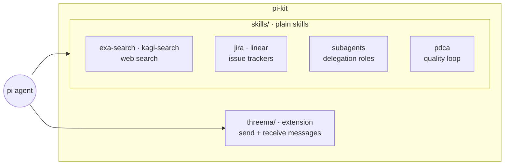

# pi-kit

This repository contains pi-related integrations and skills.

See [`ROADMAP.md`](./ROADMAP.md) for the project direction: keeping every
skill, process, and piece of tooling simple and visually understandable.



## Verification

Run every workspace test suite from the repository root:

```sh
npm test
npm run verify
```

Both commands run the same real workspace verification. The repository has no
build artifacts, so it intentionally does not define a `build` script.

Check skill configuration without exposing any values:

```sh
node skills/doctor.mjs
```

## Contents

### Extensions

- [`threema/`](./threema/) – Threema integration for pi

### Skills

Plain skills under [`skills/`](./skills/) — each is a `SKILL.md` plus, where
useful, a zero-dependency Node script the agent runs from the shell:

- [`skills/exa-search/`](./skills/exa-search/) – web search via the Exa API (`exa-search.mjs`, needs `EXA_API_KEY`)
- [`skills/grafana-logs/`](./skills/grafana-logs/) – search Grafana Cloud Loki logs through the hosted MCP server; bundled Node.js proxy with OAuth browser login, PKCE, and automatic token refresh; no `gcx` required
- [`skills/grafana-metrics/`](./skills/grafana-metrics/) – discover and query Grafana Cloud Prometheus metrics through its bundled read-only MCP proxy, sharing the OAuth login with the logs skill
- [`skills/jira/`](./skills/jira/) – Jira Cloud issue management with scoped or unscoped API tokens via a zero-dependency CLI (`jira.mjs`, needs `JIRA_BASE_URL`, `JIRA_EMAIL`, and `JIRA_AUTH_TOKEN`)
- [`skills/kagi-search/`](./skills/kagi-search/) – web search via the Kagi API (`kagi-search.mjs`, needs `KAGI_API_KEY`)
- [`skills/linear/`](./skills/linear/) – read and manage Linear issues through its GraphQL API (`linear.mjs`, needs `LINEAR_API_KEY`)
- [`skills/subagents/`](./skills/subagents/) – delegate focused work to isolated `pi` child processes with role prompts (scout, planner, implementer, critic, auditor) via `run-subagent.mjs`
- [`skills/pdca/`](./skills/pdca/) – the Plan-Do-Check-Act quality loop, described by a single diagram

Each Grafana skill includes its own `grafana.mjs` and test file directly in
[`grafana-logs/`](./skills/grafana-logs/) or
[`grafana-metrics/`](./skills/grafana-metrics/) (Node.js 22+, no dependencies).
Either directory can be copied and used independently. The duplicated scripts
use the same credential cache, so one login serves both. From the repository root:

```sh
node skills/grafana-logs/grafana.mjs login
node skills/grafana-logs/grafana.mjs tools query_loki_logs
node skills/grafana-metrics/grafana.mjs tools query_prometheus
```

Set `GRAFANA_URL` to your HTTPS stack origin if desired. For remote-shell login,
follow the [manual OAuth flow](./skills/grafana-logs/SKILL.md#configuration-and-login).
Credentials stay outside the repository; `node skills/grafana-logs/grafana.mjs status`
checks their local status. The environment doctor does not check OAuth logins.

New skills start from [`skills/TEMPLATE.md`](./skills/TEMPLATE.md): diagram
first, one page of prose, one script and focused test when code is needed, and
no runtime dependencies.

## Documentation

For installation, configuration, usage, and troubleshooting of the Threema
integration, see [`threema/README.md`](./threema/README.md).
