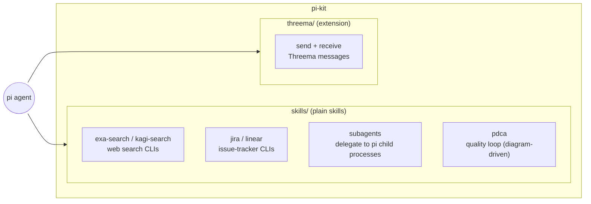
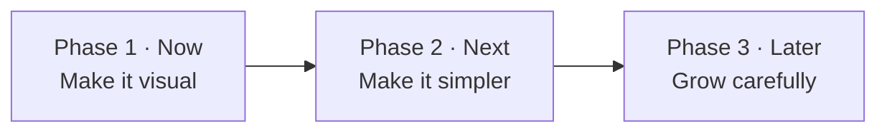

# pi-kit Roadmap

**Guiding principle: every skill, process, and piece of tooling in this
repository should be simple and visually understandable.** A newcomer should
grasp what a component does from one diagram and a short page of prose — and
anything that can't be explained that way is a candidate for simplification,
not more documentation.

## Where the project is today

pi-kit is a small toolkit for the `pi` agent: six plain skills and one
extension, all zero-dependency Node scripts verified by `npm test` from the
repository root.

### Review snapshot (August 2026)

What already matches the principle, and what doesn't yet:

| Area | State | Verdict |
| --- | --- | --- |
| Zero-dependency skill scripts | Each skill is one `SKILL.md` + one small `.mjs` | ✅ Simple |
| PDCA skill | Entire process carried by a single SVG diagram | ✅ The model to copy |
| Test story | One `npm test` at the root runs everything | ✅ Simple |
| Skill docs | Prose-only; no diagrams except PDCA | ⚠️ Not visual yet |
| Subagents skill | Herdr tab procedure is a 6-step prose recipe with an embedded Bash template | ⚠️ Too complex to follow visually |
| README | A flat link list; no picture of how the pieces fit | ⚠️ Not visual yet |
| CI | None — tests only run when someone remembers to | ⚠️ Missing safety net |
| Test coverage | `exa-search.mjs` and the Threema webhook flow lack focused tests | ⚠️ Uneven |

## The plan

Three phases, ordered so that the visual foundation lands first, then the
simplifications it exposes, then growth on top of the settled patterns.

### Phase 1 — Make it visual

Goal: every component explains itself with a diagram, the way PDCA already
does.

- [ ] **Repo map in the README.** Add the architecture diagram above (or a
      refined version) to `README.md` so the first thing a visitor sees is the
      shape of the project, not a link list.
- [ ] **One diagram per skill.** Give each `SKILL.md` a small Mermaid diagram
      at the top: the search and tracker skills get a three-node
      `env vars → CLI → API` strip; `subagents` gets a flow showing
      orchestrator → role → result.
- [ ] **Threema message-flow diagram.** `threema/README.md` is thorough but
      300 lines of prose; add one sequence diagram for outbound send and one
      for the inbound webhook path (Gateway → MAC check → allowlist →
      decrypt → pi), then trim prose the diagrams make redundant.
- [ ] **Standard skill template.** Write a short `skills/TEMPLATE.md` fixing
      the common shape: frontmatter, diagram, configuration table, commands,
      safety notes. New and existing skills converge on it.

### Phase 2 — Make it simpler

Goal: remove the places where following the docs requires careful multi-step
reading.

- [ ] **Script the Herdr procedure.** Replace the 6-step manual tab recipe in
      `skills/subagents/SKILL.md` with a small helper (e.g.
      `run-in-herdr-tab.sh`) so the skill doc shrinks to "inside Herdr, run
      this instead" plus one diagram. Cover it with a test alongside
      `run-subagent.test.mjs`.
- [ ] **Add CI.** One GitHub Actions workflow that runs `npm test` on pushes
      and pull requests — a green check is the simplest possible status
      visualization.
- [ ] **Even out test coverage.** Add a request-shaping test for
      `exa-search.mjs` (mirroring `kagi-search-request.test.mjs`) so every
      skill script has at least one focused test.
- [ ] **Align the search skills.** `exa-search` and `kagi-search` should share
      identical doc structure and flag conventions (`--json`, limits, error
      handling) so learning one means knowing both.

### Phase 3 — Grow carefully

Goal: add capability only where it keeps the one-diagram, one-page property.

- [ ] **Skill health check.** A tiny `doctor` script that reports, per skill,
      whether its required environment variables are set — one table, at a
      glance.
- [ ] **New skills on the template.** Candidate integrations (e.g. GitHub
      issues, calendar) enter only via the Phase 1 template: diagram first,
      one script, one test, zero dependencies.
- [ ] **Sub-agent role diagram.** A single picture of how the five roles
      (scout, planner, implementer, critic, auditor) compose into the
      plan → implement → review pattern, replacing the prose "Patterns"
      section.

## What we deliberately won't do

Simplicity is also about refusal:

- No build step — the repo stays runnable-as-checked-out.
- No runtime dependencies in skills — each stays a single copyable script.
- No frameworks or generators for docs — Markdown plus Mermaid, rendered by
  GitHub, is the whole toolchain.
- No skill whose behavior can't be captured in one diagram and one page.

## Definition of done, per component

Progress is tracked by checking off the items above; a phase is finished when
its boxes are ticked and each touched component passes the definition of done.
