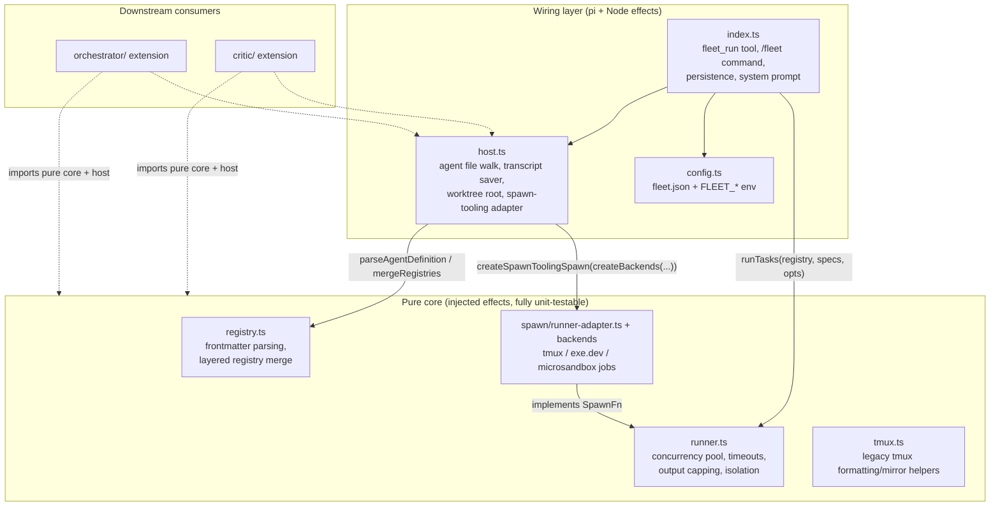
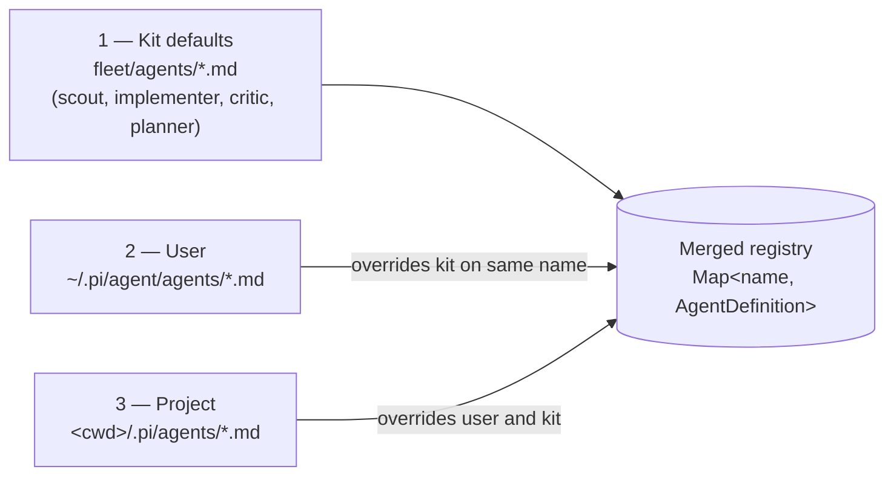
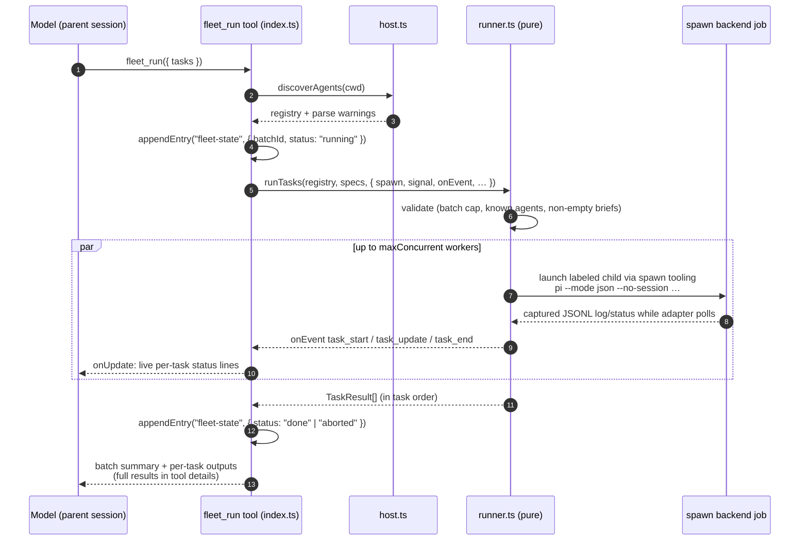
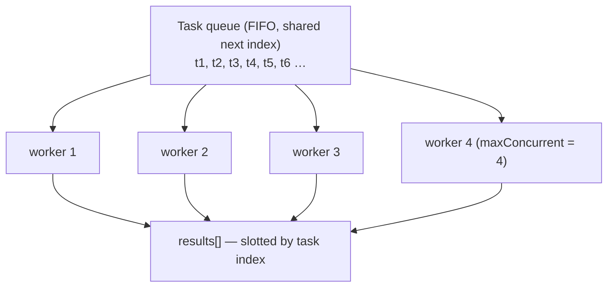
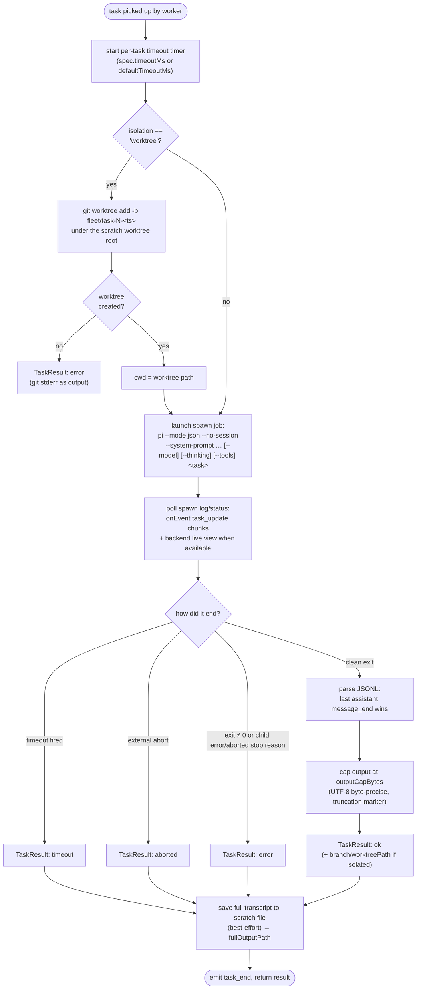
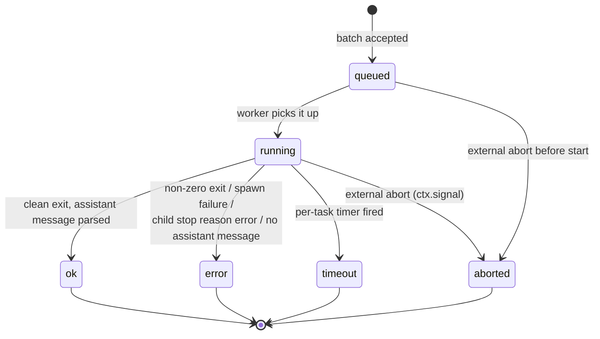
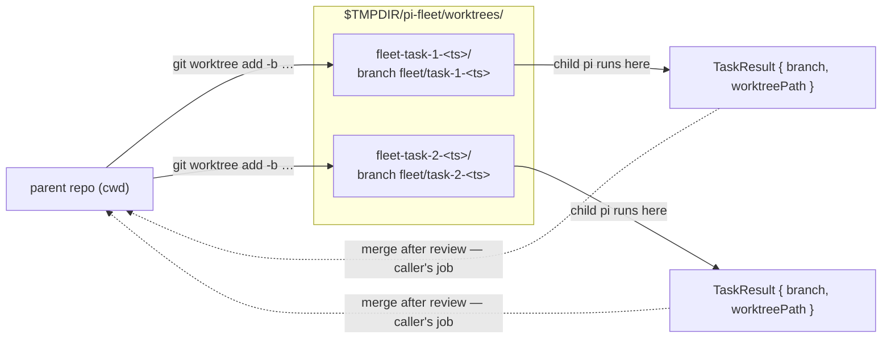
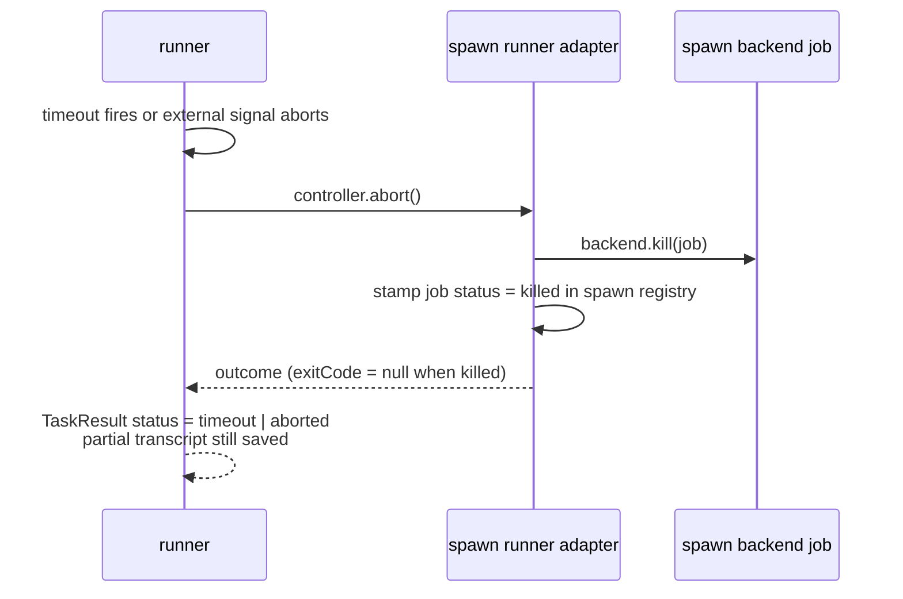
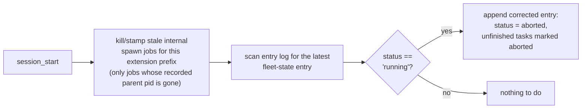
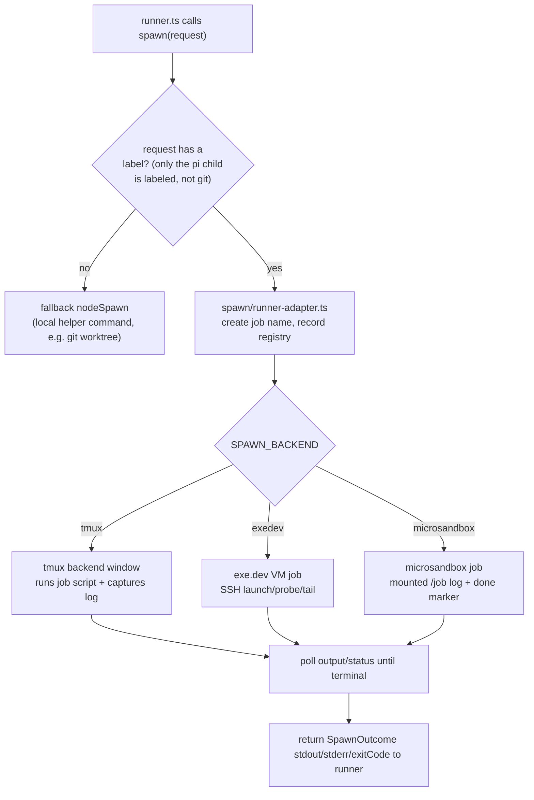

# Fleet architecture — how the sub-agent runtime works

This document explains the internals of [`fleet/`](../fleet/): how agent
definitions are discovered, how a batch of tasks flows through the runner, how
concurrency, timeouts, isolation, and cancellation behave, and how spawn
backends provide execution/live visibility. For installation, configuration, and usage,
see the [fleet README](../fleet/README.md); for the original design rationale,
see [multi-agent-orchestration.md](./multi-agent-orchestration.md). In the
[Micro-V'ave execution model](./micro-vave-execution-model.md), fleet is the
vertex of every micro-V — the implementation step between the descending
specification leg and the ascending verification leg — and its concurrency
pool is the model's granularity axis (the stack of parallel micro-Vs).

Fleet is the **fan-out primitive** of the pi-kit multi-agent stack: it runs N
sub-agents through the shared spawn tooling, each with its own context window,
role prompt, model, and tool restrictions, while preserving synchronous
per-task results. The critic and orchestrator extensions are built on top of
its pure core.

## Contents

- [Module architecture](#module-architecture)
- [Agent definitions and discovery](#agent-definitions-and-discovery)
- [Life of a batch: `fleet_run` end to end](#life-of-a-batch-fleet_run-end-to-end)
- [The concurrency pool](#the-concurrency-pool)
- [Life of a single task](#life-of-a-single-task)
- [Task states and outcomes](#task-states-and-outcomes)
- [The child-process contract](#the-child-process-contract)
- [Output discipline](#output-discipline)
- [Worktree isolation](#worktree-isolation)
- [Timeouts, aborts, and kill semantics](#timeouts-aborts-and-kill-semantics)
- [Persistence and restart safety](#persistence-and-restart-safety)
- [Spawn tooling backend](#spawn-tooling-backend)
- [Events and observability](#events-and-observability)

## Module architecture

Fleet is split into a **pure core** (no pi imports, no Node APIs — every
effect is injected) and a thin **wiring layer** that provides the real
effects. Other extensions reuse the pure core plus `host.ts` directly; they
never import `index.ts`.



The dependency rule: `runner.ts` and `tmux.ts` never import `pi` or
`node:child_process` — a `SpawnFn` is injected. That is why the whole engine
can be tested with fakes (no processes, no network) and reused by the critic
and orchestrator in any context.

## Agent definitions and discovery

An agent is a markdown file: YAML-ish frontmatter (flat `key: value` only, by
design) plus a body that becomes the child's **system prompt**.

```markdown
---
name: implementer
description: Implements one well-scoped task to completion, tests included.
model: claude-sonnet-5          # optional; defaults to parent's model
thinkingLevel: medium           # optional
tools: read, bash, edit, write  # optional allowlist; omit = parent's tools
---
You implement exactly one task. ...
```

`registry.ts` validates each definition (name format, required description,
non-empty body, known thinking levels, non-empty tool list) and throws with
the file path in the message. `host.ts` walks three locations and
`mergeRegistries` merges them — **later layers win** on (case-insensitive)
name collision, and invalid files are collected as warnings instead of
failing the whole layer:



The four kit-shipped defaults divide the roles:

| Agent | Tools | Role |
|---|---|---|
| `scout` | read, grep, find, ls | Read-only exploration; answers one focused question |
| `planner` | read, grep, find, ls | Read-only decomposition of a goal into tasks |
| `implementer` | *(inherits parent's)* | Implements exactly one well-scoped task |
| `critic` | read, grep, find, ls | Independent read-only review against explicit criteria |

Discovery runs fresh on every `fleet_run` and `/fleet` call, so edits to agent
files take effect immediately.

## Life of a batch: `fleet_run` end to end

`fleet_run` takes `{ tasks: [{ agent, task, isolation?, timeoutMs? }, ...] }`
and returns per-task results in task order. Here is the full path of one
batch:



Every dispatched batch is also emitted on the shared event bus
(`fleet:task_start`, `fleet:task_update`, `fleet:task_end`) so other
extensions can observe progress without coupling.

## The concurrency pool

The runner is a FIFO pool: `min(maxConcurrent, tasks.length)` workers share a
single `next` index and pull the next task until the list is exhausted.
Results land at their original index, so output order always matches input
order regardless of completion order.



Two caps bound a batch:

- **`maxConcurrent`** (default 4) — how many children run at once.
- **`maxBatch`** (default 8) — how many tasks one `fleet_run` call may carry;
  larger requests are rejected with an instruction to split.

If the external abort signal fires, workers stop pulling: tasks not yet
started are immediately resolved as `aborted` ("task aborted before start")
without spawning anything.

## Life of a single task

Inside a worker, one task moves through this pipeline (`runOneTask`):



## Task states and outcomes

From the caller's perspective a task is a tiny state machine; the terminal
status is recorded in `TaskResult.status`:



`TaskResult` carries everything a caller needs to act on the outcome:

| Field | Meaning |
|---|---|
| `agent` | Resolved agent definition name |
| `status` | `ok` \| `error` \| `timeout` \| `aborted` |
| `output` | Final assistant message, capped (the model-visible part) |
| `fullOutputPath` | Scratch file with the untruncated JSONL transcript |
| `truncated` | Whether `output` hit the cap |
| `durationMs`, `exitCode` | Timing and process exit |
| `branch`, `worktreePath` | Set when the task ran with worktree isolation |

## The child-process contract

The entire coupling to pi's non-interactive mode is pinned in one function,
`buildPiArgs(def, spec)`, so version drift is contained:

```
pi --mode json --no-session
   --system-prompt <agent body>
   [--model <def.model>]
   [--thinking <def.thinkingLevel>]
   [--tools <t1,t2,…>]
   <task text>
```

- `--mode json` selects single-shot print mode emitting a JSONL event stream.
- `--no-session` keeps children out of the session directory — a sub-agent
  run leaves no session behind.
- The agent definition supplies the system prompt, model, thinking level, and
  tool allowlist; anything omitted inherits the parent's defaults.

Parsing (`parsePiJsonOutput`) is deliberately tolerant: non-JSON lines are
skipped, and the **last** assistant `message_end` event wins. A stream with no
assistant message, or one whose final message carries an `error`/`aborted`
stop reason, produces an `error` result — never a silent empty success.

## Output discipline

Sub-agent output must not blow up the parent's context window:

- The model-visible `output` is capped at `outputCapBytes` (default 50 KB),
  measured in **UTF-8 bytes** (multi-byte characters counted correctly), with
  an explicit `[... output truncated at N bytes ...]` marker.
- The **full transcript** (the raw JSONL stream) is written to a scratch file
  (`$TMPDIR/pi-fleet/task-<timestamp>-<n>.jsonl`) and referenced by
  `fullOutputPath`, so nothing is lost — it is just not forced into context.
- Transcript persistence is best-effort: if the write fails, the result
  stands without it.

## Worktree isolation

With `isolation: "worktree"` parallel writers cannot trample each other or
the parent's tree: each task runs on its own branch in its own checkout.



The branch name and worktree path are derived deterministically
(`fleet/task-<index+1>-<startedAt>`) and reported in the result. **Merging is
explicitly not the runner's job** — the calling session (or the orchestrator,
which merges only reviewed-passing branches, serially, in DAG order) does that
afterwards. If `git worktree add` fails, the task fails with git's stderr as
its output; the child is never spawned.

## Timeouts, aborts, and kill semantics

Every task gets its own `AbortController`; two things can trip it:

1. **Per-task timeout** — `spec.timeoutMs` (or the config default of 10
   minutes). The result status becomes `timeout`.
2. **External abort** — the tool-call `ctx.signal` (user abort). The result
   status becomes `aborted`; queued tasks abort without starting.



Fleet still treats aborted work as finished for the synchronous tool call: the
spawn job is killed/stamped and whatever output was available before the kill
is captured and saved as the transcript.

## Persistence and restart safety

Dispatched batches are recorded as `fleet-state` entries in the session entry
log (`{ batchId, status: running → done | aborted, tasks[] }`). Internal
synchronous spawn jobs are named with the extension prefix (`pi-fleet`,
`pi-orchestrator`, `pi-critic`) and recorded in the spawn registry. On session
start, any still-running internal jobs for that prefix are killed/stamped, and
a batch that is still marked `running` is treated as interrupted and reset just
as before:



This is the fleet half of crash recovery; the orchestrator layer (see the
[orchestrator architecture](./orchestrator-architecture.md)) resets the plan's
`running` tasks back to `ready` so the run can resume idempotently.

## Spawn tooling backend

Labeled sub-agent children are executed by `spawn/runner-adapter.ts`, which
adapts spawn's backend/job API to fleet's synchronous `SpawnFn`. The adapter
records each job in the spawn registry, polls backend status/output, streams
log deltas into fleet progress events, and kills/stamps the job on abort.

With the default `tmux` backend, every sub-agent runs in a live,
human-watchable window in one shared tmux session (default `pi-agents`, shared
with the critic and orchestrator so a single `tmux attach -t pi-agents` shows
all delegated work). With `exedev` or `microsandbox`, the same adapter waits on
that backend instead.

The legacy `createTmuxMirrorSpawn` helper remains in `tmux.ts` for formatting
utilities and tests, but host wiring no longer uses it for sub-agent execution:



Design properties worth knowing:

- **Sub-agents through spawn** — the child `pi` command is no longer launched
  directly by fleet/orchestrator/critic host wiring; it is handed to a spawn
  backend as a prebuilt command.
- **Helper commands stay local** — unlabeled commands such as `git worktree add`
  keep using the local fallback because their side effects must happen in the
  parent working tree.
- **Synchronous contract preserved** — fleet still owns concurrency, timeouts,
  JSONL parsing, output capping, and `TaskResult` construction.
- **Backend caveat** — remote backends must be able to see the intended code
  and credentials; exe.dev runner jobs `cd` to the requested cwd on the VM and
  fail if it is absent, while microsandbox can mount the cwd.

## Events and observability

Fleet exposes four complementary views of the same run:

| Surface | What you see | Consumer |
|---|---|---|
| `onUpdate` tool streaming | Per-task status lines (`queued` → `running` → outcome) | The parent session UI |
| `pi.events` bus (`fleet:task_start/update/end`) | Structured progress events | Other extensions (e.g. the orchestrator re-emits these) |
| tmux windows | Live human-readable transcript per sub-agent | The user, out-of-band |
| `fleet-state` session entries + transcripts | Durable record of batches and full outputs | Restart recovery, debugging |

The `/fleet` command ties it together interactively: discovered agents (with
source and overrides), definition errors, pool limits, tmux status, and
whether a batch is currently in flight.
