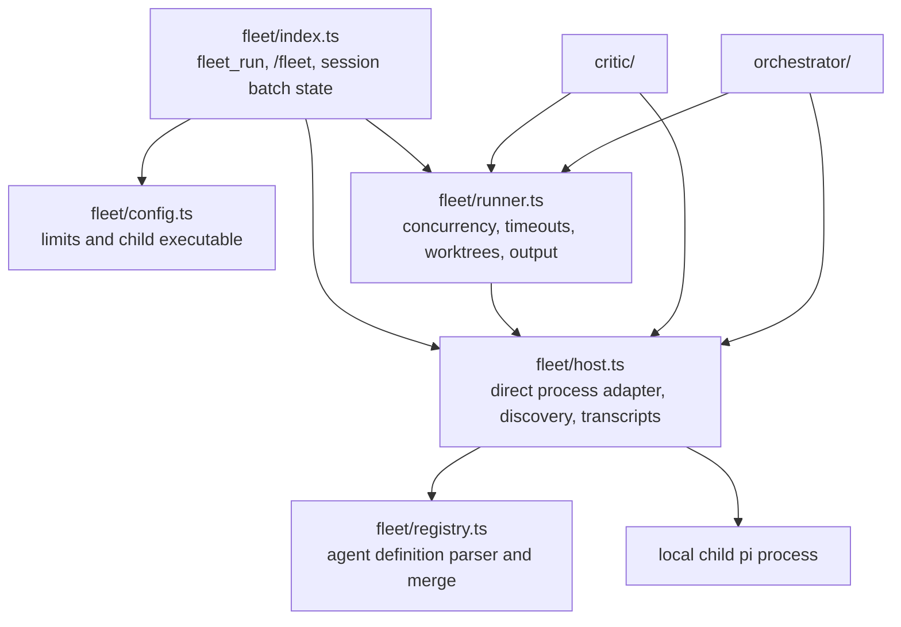
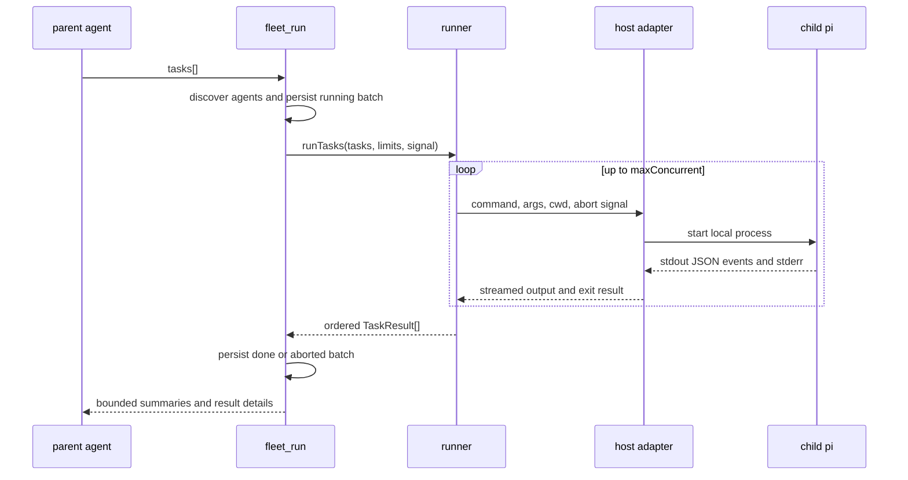

# Fleet architecture

Fleet is pi-kit's synchronous fan-out primitive. It runs local child `pi`
processes with isolated context windows and returns ordered task results to the
caller. Critic and Orchestrator reuse the same core and host adapter.

## Module boundaries


```mermaid
flowchart TB
  index["fleet/index.ts\nfleet_run, /fleet, session batch state"]
  config["fleet/config.ts\nlimits and child executable"]
  host["fleet/host.ts\ndirect process adapter, discovery, transcripts"]
  runner["fleet/runner.ts\nconcurrency, timeouts, worktrees, output"]
  registry["fleet/registry.ts\nagent definition parser and merge"]
  child["local child pi process"]
  critic["critic/"]
  orchestrator["orchestrator/"]

  index --> config
  index --> host
  index --> runner
  host --> registry
  runner --> host
  host --> child
  critic --> runner
  critic --> host
  orchestrator --> runner
  orchestrator --> host
```

`runner.ts` is a pure engine with an injected process function. It does not
import pi or Node process APIs. `host.ts` supplies the production Node adapter,
filesystem discovery, transcript persistence, and worktree scratch roots.

There is one production execution path: a direct local child process. The
runtime has no placement selector or alternate transport.

## Agent discovery

Agent definitions are Markdown files with frontmatter and a system-prompt
body. Fleet merges three layers, with later layers winning by case-insensitive
name:

1. `fleet/agents/*.md`
2. `~/.pi/agent/agents/*.md`
3. `<cwd>/.pi/agents/*.md`

Invalid definitions are reported as warnings without hiding valid definitions
from the same layer.

## Batch lifecycle


```mermaid
sequenceDiagram
  participant P as parent agent
  participant F as fleet_run
  participant R as runner
  participant H as host adapter
  participant C as child pi

  P->>F: tasks[]
  F->>F: discover agents and persist running batch
  F->>R: runTasks(tasks, limits, signal)
  loop up to maxConcurrent
    R->>H: command, args, cwd, abort signal
    H->>C: start local process
    C-->>H: stdout JSON events and stderr
    H-->>R: streamed output and exit result
  end
  R-->>F: ordered TaskResult[]
  F->>F: persist done or aborted batch
  F-->>P: bounded summaries and result details
```

The runner validates batch size, task briefs, agent names, and worktree
requirements before or during dispatch. A FIFO worker pool limits active tasks
to `maxConcurrent`; result slots preserve input order.

## Child command contract

`buildPiArgs` owns the command-line coupling to pi:

```text
pi --mode json --no-session --no-extensions --no-skills
   --system-prompt <agent prompt>
   [--model <model>]
   [--thinking <level>]
   [--tools <allowlist>]
   <task brief>
```

`inheritChildResources: true` omits the two resource-isolation flags for a
custom role that intentionally needs parent extensions or skills.

The parser tolerates non-JSON lines and uses the last assistant `message_end`.
An error/aborted stop reason or missing final assistant message produces an
error result.

## Worktree isolation

For `isolation: "worktree"`, the runner creates a task branch under a temporary
worktree root and runs the child there. `parentBranch` supports prerequisite
branch handoff, while stable worktree keys support restart recovery. The result
carries the branch and path. Fleet never merges; reviewed integration belongs
to the caller or Orchestrator.

Auxiliary git commands use the same local process adapter but are not sub-agent
runs.

## Timeouts and cancellation

Each active task owns an `AbortController`. Either its configured timeout or
the parent signal can abort it. The host adapter sends `SIGTERM`, waits a short
grace period, then sends `SIGKILL` if the child remains alive. Queued tasks
observe cancellation before launch.

Outcomes are normalized to `ok`, `error`, `timeout`, or `aborted`.

## Output discipline

The host streams stdout to progress callbacks while accumulating stdout and
stderr for the final result. The runner:

- parses the final assistant response;
- caps model-visible output by UTF-8 bytes;
- includes the truncation marker inside that cap; and
- saves the complete JSONL stream under the system temporary directory.

Transcript persistence is best-effort; execution results remain valid if a
transcript cannot be written.

## Persistence and observability

`fleet/index.ts` records each batch as a `fleet-state` session entry. On
session restart, a previously running batch is marked aborted. Active child
processes remain owned by the original tool call and its cancellation signal;
there is no detached-job registry.

Progress is available through tool updates and `fleet:task_start`,
`fleet:task_update`, and `fleet:task_end` events. `/fleet` lists discovered
roles, limits, the direct execution path, and the active batch.

## Verification

`fleet/test.ts` covers parsing, discovery, command construction, concurrency,
timeouts, cancellation, output caps, event ordering, worktrees, run identity,
artifact handoff, and direct host-process behavior.
