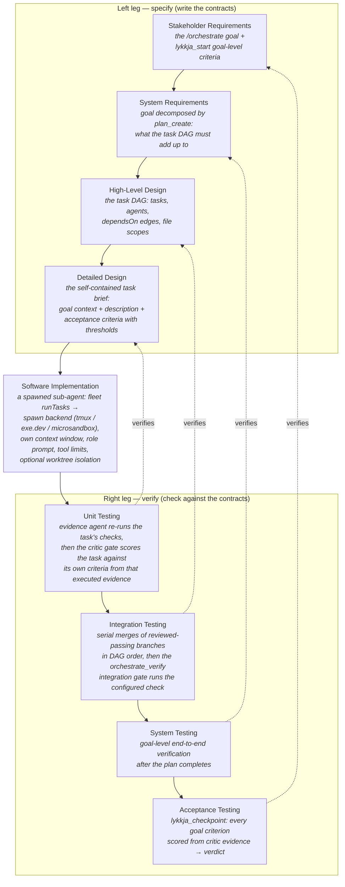
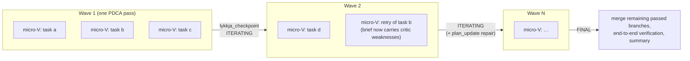

# The Micro-V'ave execution model — how pi-kit implements it

This document links the pi-kit multi-agent stack — task orchestration
([`orchestrator/`](../orchestrator/) + [`planner/`](../planner/)), sub-agent
spawning ([`fleet/`](../fleet/) + [`spawn/`](../spawn/)), and PDCA looping
([`lykkja/`](../lykkja/) + [`critic/`](../critic/)) — to the **Micro-V'ave
execution model**
([Excalidraw board](https://link.excalidraw.com/l/5vpHZkNnyYu/8NTS5XyN6Lo),
the source of truth for the model itself).

The one-sentence version: **an `/orchestrate` run is a Micro-V'ave: the goal
is sliced into small scope increments, each slice descends and ascends its own
micro V-model inside one dispatch wave, parallel micro-Vs stack along the
granularity axis, PDCA passes string the waves along the time axis, and every
wave emits verified product chunks.**

## Contents

- [The model in brief](#the-model-in-brief)
- [One micro-V, one task](#one-micro-v-one-task)
- [The two axes: waves and stacks](#the-two-axes-waves-and-stacks)
- [Scope slices in, product chunks out](#scope-slices-in-product-chunks-out)
- [The dashed arrows: verification against the paired contract](#the-dashed-arrows-verification-against-the-paired-contract)
- [PDCA as the wave engine](#pdca-as-the-wave-engine)
- [Component-to-model map](#component-to-model-map)

## The model in brief

The Micro-V'ave model takes the classic systems-engineering V-model —
specification descending the left leg, implementation at the vertex,
verification ascending the right leg, each testing level checking back
against the specification level written opposite it — and shrinks and
multiplies it along two axes:

- **Micro** — instead of one project-sized V, the scope is cut into small
  *input scope slices*, and each slice runs a complete miniature V of its
  own: requirements → design → implementation → unit → integration → system
  → acceptance testing, at task scale.
- **V'ave** (V + wave) — micro-Vs repeat along the **time** axis as
  successive waves, and stack along the **granularity** axis as parallel
  instances within a wave. Each completed micro-V emits a *verified product
  output chunk*; the product accretes chunk by chunk, wave by wave.

Two properties make the model more than "small iterations":

1. **Every level of descent writes the contract that the matching level of
   ascent will be checked against.** Verification is never invented after
   the fact.
2. **A chunk only leaves a micro-V through its acceptance level.** Unverified
   work never becomes product.

pi-kit implements both properties by construction, as shown below.

## One micro-V, one task

Each task dispatched by the orchestrator is one micro-V. The left leg is
built by the orchestrating session at planning time; the vertex is a spawned
sub-agent; the right leg ascends through the critic gate, DAG-order merges,
end-to-end verification, and the lykkja checkpoint.

The pairing of levels is exact, not decorative:

| V level (down) | Written by | V level (up) | Checked by |
|---|---|---|---|
| Stakeholder Requirements — the goal and its strict, measurable bar | `lykkja_start` (goal-level criteria) | Acceptance Testing | `lykkja_checkpoint` — every criterion scored honestly from critic verdicts; only `FINAL` ends the run |
| System Requirements — what the decomposition must add up to | `plan_create` (the plan as data), with per-task `covers` tags tracing goal criteria into the DAG | System Testing | goal-level end-to-end verification, required before the final checkpoint; per-criterion coverage read off the plan |
| High-Level Design — the task DAG and its dependency/merge order | planner DAG (`dependsOn`, per-task file scopes), verified up front by the `critic_advise` plan review gate | Integration Testing | serial DAG-order merges of passed branches, then the `orchestrate_verify` integration gate runs the configured check on the merged tree; a conflict or a failed gate is a recorded review failure |
| Detailed Design — one task's brief and acceptance criteria | per-task criteria attached at decomposition time | Unit Testing | the evidence agent independently re-runs the task's verification commands, then the critic gate reviews against *that task's own* criteria from the executed evidence |
| Software Implementation | fleet + spawn sub-agent | — the vertex — | the sub-agent's self-report is informational only; it can never pass its own work |

One shared vocabulary holds the two legs together: lykkja's
`Criterion`/`CriterionScore` types are used from `lykkja_start` through
`plan_create` to `buildCriticPrompt` and back into `lykkja_checkpoint` — the
contract written on the way down is *literally the same object* scored on the
way up.

## The two axes: waves and stacks

The Excalidraw board arranges micro-Vs on a **time** axis (successive Vs)
and a **granularity** axis (stacked Vs behind each other). Both axes have a
direct owner in pi-kit:

- **Time axis = the outer PDCA loop.** Each `orchestrate_step` call is one
  dispatch wave and one Plan-Do-Check-Act pass of the single lykkja loop
  that *is* the run. Waves repeat until the lykkja verdict is `FINAL`
  (every goal criterion at threshold) or `STOPPED` (the honesty-preserving
  iteration cap).
- **Granularity axis = the concurrent ready set.** Within a wave, the pure
  scheduler (`nextActions`) dispatches every task whose dependencies are
  done, capped at `maxConcurrent`. Each of those tasks is its own micro-V
  running in parallel — fleet's concurrency pool with per-task worktree
  isolation is the stack of V cards in the diagram.

## Scope slices in, product chunks out

The diagram's pizza slices and checked boxes are the run's unit economics:

- **Input scope slices** — `plan_create` cuts the goal into small,
  independently briefable tasks; each wave feeds the currently-ready slices
  into fresh micro-Vs. Slicing is a planning concern (the
  `plan-decomposition` skill): slices should be small enough for one
  sub-agent context window and disjoint enough to run in parallel.
- **Product output chunks** — a chunk exits a micro-V only at the top of the
  right leg: the task passed its critic review *and* its branch merged
  cleanly in DAG order. In worktree mode the chunk is literally a merged
  branch; unreviewed or failed work stays sealed inside its worktree and is
  never merged. The product is the accretion of these verified chunks,
  wave by wave.

## The dashed arrows: verification against the paired contract

The model's defining edge — each testing level pointing back at the
specification level opposite it — is also pi-kit's retry mechanism. When an
ascent fails, the micro-V re-descends *from the paired level down*, with the
contract sharpened by what was learned:

| Failed ascent | Re-descent from | Mechanism |
|---|---|---|
| Unit Testing (critic `FAILED`) | Detailed Design | the critic's prioritized weaknesses are appended to the brief; the task re-queues as `ready` and a fresh sub-agent re-runs the vertex — until the shared `maxAttempts` budget is spent |
| Integration Testing (merge conflict) | Detailed Design | the conflict is recorded as a review-failure weakness and takes the same retry path |
| System Testing (end-to-end gap) / Acceptance Testing (checkpoint below bar) | High-Level Design / System Requirements | verdict `ITERATING` + `plan_update`: follow-up tasks appended to the DAG targeting the recorded weaknesses, or explicit descoping — never silent |

Failure containment follows the V pairing too: a task `failed` at the
attempt cap never satisfies its dependents' `dependsOn`, so the DAG holds
the affected slice back (`blocked`) until the model repairs the plan at the
design level — the failure surfaces at exactly the level whose contract it
broke.

## PDCA as the wave engine

PDCA is not a fifth concept bolted onto the model — it is the temporal
engine that advances the V'ave. One wave maps phase by phase:

- **PLAN** — descend the left leg for this wave: `nextActions` computes the
  ready slice set; briefs are built (and, after a failed wave,
  `plan_update` repairs the design first).
- **DO** — the vertex: fleet dispatches the wave's sub-agents through the
  selected spawn backend, concurrently.
- **CHECK** — ascend the right leg: critic verdicts per task (never the
  sub-agent's own optimism), merges, end-to-end verification.
- **ACT** — `lykkja_checkpoint` scores the goal criteria from that evidence
  and its verdict selects what happens next: `ITERATING` starts the next
  wave, `FINAL` closes the run at the acceptance level, `STOPPED` reports
  honestly which contracts are still unmet.

The lykkja rules ("the critic's verdicts are the CHECK — never your own
optimism", "no soft passes", the 25-pass cap) are what keep the right leg of
every micro-V honest; without them the V'ave degenerates into open-loop
iteration.

## Component-to-model map

| Micro-V'ave concept | pi-kit owner | Where |
|---|---|---|
| Goal + acceptance contract | lykkja | `lykkja_start`, goal-level criteria |
| Scope slicing | planner | `plan_create`, `plan-decomposition` skill |
| Micro-V left leg (design → brief) | orchestrator + planner | `orchestrate_step` brief building, per-task criteria |
| Vertex (implementation) | fleet + spawn | `runTasks`, spawn backends, worktree isolation |
| Unit Testing (per-slice verification) | critic + fleet auditor | the evidence agent re-runs the checks, then the critic gate scores (`buildCriticPrompt`/`parseCriticOutput`) |
| Integration Testing | orchestrator | serial DAG-order merges of passed branches + the `orchestrate_verify` gate (`integrationCheck`) |
| Design review (left-leg verification) | critic | the `critic_advise` plan review gate before the first wave |
| Goal-criterion traceability | planner | per-task `covers` tags, `coverageByCriterion`, coverage in every wave report |
| System + Acceptance Testing | lykkja | end-to-end verification + `lykkja_checkpoint` verdict |
| Time axis (waves) | orchestrator + lykkja | one PDCA pass per `orchestrate_step`, verdict-driven |
| Granularity axis (parallel stack) | fleet | concurrency pool, `maxConcurrent`, isolation |
| Dashed verify-back edges (retries) | orchestrator scheduler | `applyTaskResult` / `applyReview` retry-with-feedback |
| Product output chunks | orchestrator | merged, critic-passed branches per wave |

For the mechanics behind each row, see the
[orchestrator architecture](./orchestrator-architecture.md) (waves, scheduler,
critic gate, PDCA loop) and the
[fleet architecture](./fleet-architecture.md) (the vertex: sub-agent runtime,
concurrency, isolation, spawn backends).
