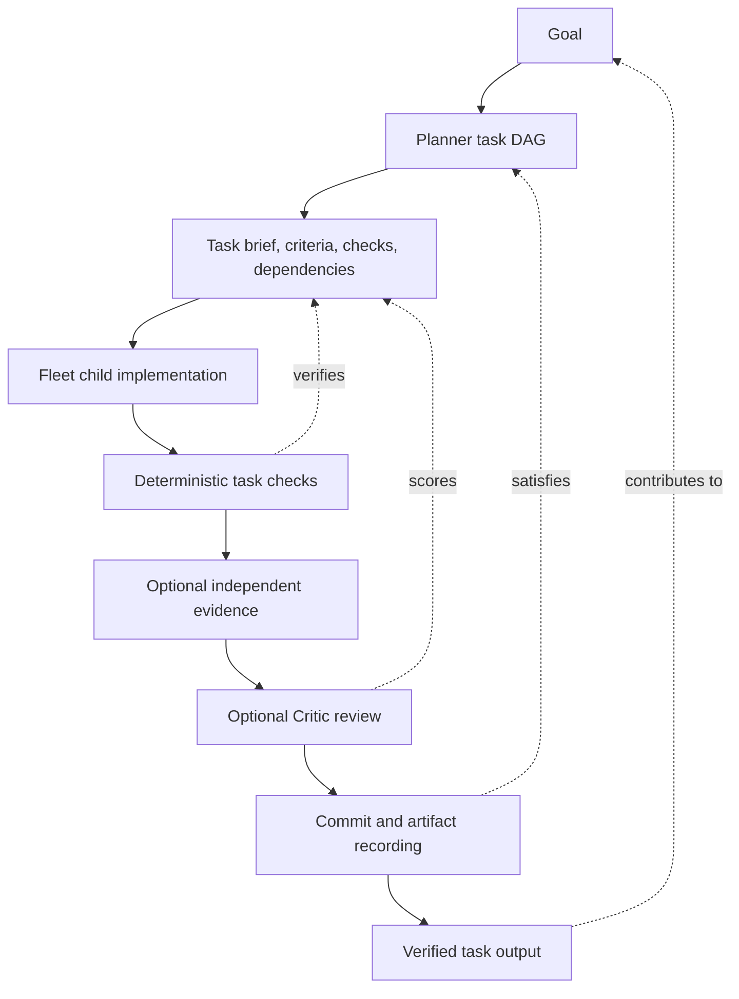
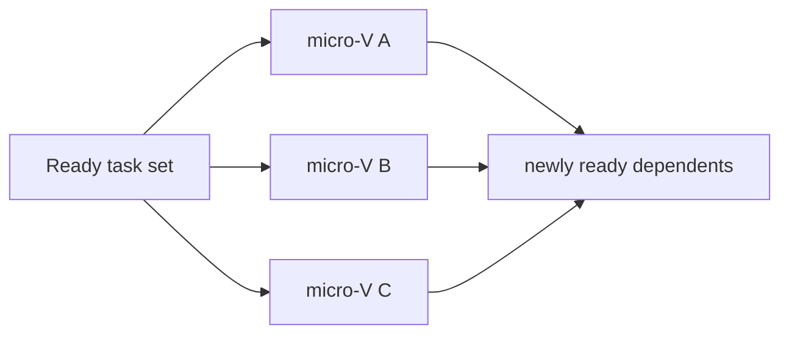

# The Micro-V'ave execution model in pi-kit

The Micro-V'ave model treats each planned task as a small V-model: explicit
requirements descend into implementation, then deterministic and semantic
verification ascend against the same contract. Independent task Vs run in
parallel, and verified outputs unlock later slices of the DAG.

## One task, one micro-V

```mermaid
flowchart TB
  goal["Goal"] --> dag["Planner task DAG"]
  dag --> brief["Task brief, criteria, checks, dependencies"]
  brief --> implementation["Fleet child implementation"]
  implementation --> checks["Deterministic task checks"]
  checks --> evidence["Optional independent evidence"]
  evidence --> review["Optional Critic review"]
  review --> artifact["Commit and artifact recording"]
  artifact --> accepted["Verified task output"]

  checks -. verifies .-> brief
  review -. scores .-> brief
  artifact -. satisfies .-> dag
  accepted -. contributes to .-> goal
```

The implementation vertex is a direct local child `pi` process with its own
context, role prompt, tool limits, timeout, and optional git worktree.

## Paired contracts

| Specification on the way down | Verification on the way up |
| --- | --- |
| Goal and final acceptance | Plan final checks and terminal controller result |
| DAG dependencies and branch handoff | Readiness and integration checks |
| Task description and criteria | Critic rubric |
| Typed task checks | Direct command results |
| Worktree scope | Reviewed commit and artifact record |

Verification is not invented after implementation: each task carries its
checks and criteria before dispatch.

## Parallel stacks

The Planner DAG exposes all tasks whose dependencies are done. Orchestrator can
run up to `maxConcurrent` complete pipelines at once. Each pipeline owns one
micro-V from implementation through review and artifact recording.

```mermaid
flowchart LR
  ready["Ready task set"] --> a["micro-V A"]
  ready --> b["micro-V B"]
  ready --> c["micro-V C"]
  a --> next["newly ready dependents"]
  b --> next
  c --> next
```

A fast task can enter checks and review before a slower sibling finishes. The
controller reduces each outcome into authoritative state and immediately
recalculates readiness.

## Scope slices and product chunks

`plan_create` turns the goal into independently verifiable scope slices. A
slice should fit one child context and declare enough file scope to decide
whether it can run beside other writers.

A product chunk exits its micro-V only after required checks, optional review,
and worktree commit/artifact recording pass. Failed or unreviewed branch work
does not unlock dependents.

## Failure and re-descent

When ascent fails, the task returns to the implementation vertex with bounded
feedback:

| Failure | Feedback source | Result |
| --- | --- | --- |
| Child error or timeout | execution | retry while attempts remain |
| Command failure | check output and exit status | retry while attempts remain |
| Critic failure | prioritized weaknesses | retry while attempts remain |
| Commit/integration failure | artifact detail | retry or block |

The original task description remains unchanged. Only a bounded set of newest
feedback entries is rendered into the next brief. At the attempt cap, the task
fails and affected dependents remain blocked while unrelated DAG branches can
continue.

## Time axis

The deterministic controller, not a mandatory parent checkpoint, advances the
time axis. `orchestrate_run` repeatedly drains ready pipelines until verified,
blocked, stopped, awaiting branch integration, or budget-exhausted.

An optional PDCA compatibility mode can add goal-level checkpoint decisions.
Standalone PDCA also remains available, but neither is required to execute the
task DAG.

## Component map

| Model concept | Owner |
| --- | --- |
| Goal decomposition | Planner |
| Parallel implementation vertices | Fleet |
| Deterministic verification | Orchestrator checks |
| Independent semantic verification | Critic |
| Attempts and bounded feedback | Orchestrator scheduler |
| Branch/product artifacts | Fleet worktrees + Orchestrator handoff |
| Time-axis controller | `orchestrate_run` |
| Optional goal loop | PDCA compatibility control |

See [fleet architecture](./fleet-architecture.md) for the child runtime and
[orchestrator architecture](./orchestrator-architecture.md) for pipeline,
state, and recovery details.
