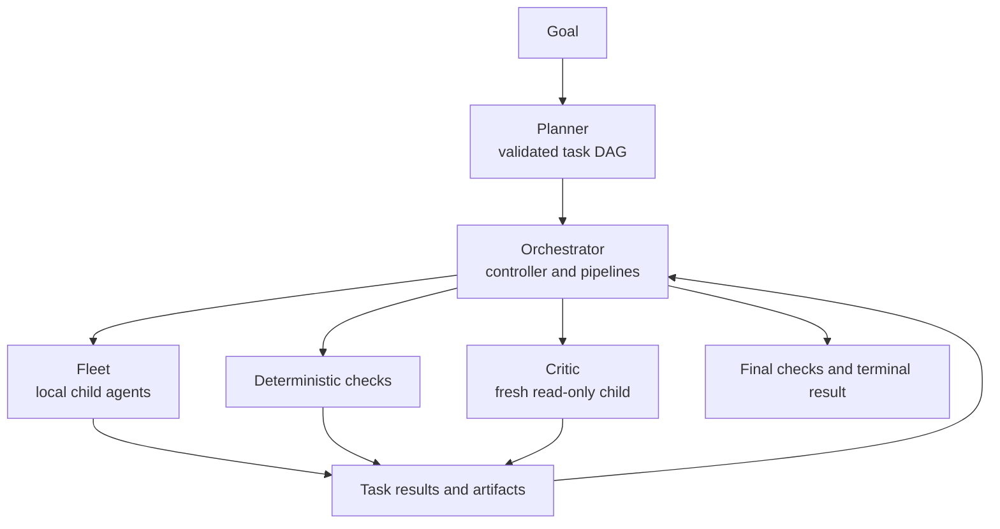

# Multi-agent orchestration for pi-kit

Status: **implemented** by [`fleet/`](../fleet/),
[`planner/`](../planner/), [`critic/`](../critic/), and
[`orchestrator/`](../orchestrator/).

The stack decomposes a goal into a validated task DAG, runs independent local
child agents with bounded concurrency, checks results deterministically, and
optionally asks a fresh read-only critic to score each task.

## Goals

- Run independent tasks concurrently without sharing child context.
- Represent plans as validated data rather than prose.
- Keep task intent, dependencies, acceptance criteria, and checks explicit.
- Isolate parallel writers with optional git worktrees.
- Separate implementation from independent review.
- Persist enough authoritative state to resume interrupted runs.
- Bound child output, feedback, retries, and controller work.

## Non-goals

- No long-lived child-agent daemon.
- No remote placement or execution-runner selection.
- No changes to pi core.
- No implicit merging of arbitrary parallel branches.
- No requirement that standalone PDCA usage change.

## Architecture



Modules compose through pure-core imports, pi events, session entries, and
model-visible tools. Extensions never import another extension's `index.ts`.

## Fleet

Fleet owns process lifecycle, concurrency, timeouts, output handling, and
optional worktree isolation. It starts a direct local child `pi` process for
each task and returns a synchronous `TaskResult`.

The child receives its role's system prompt, optional model/thinking settings,
and tool allowlist. Extensions and skills are disabled by default to prevent
recursive orchestration. Full JSONL output is saved separately while the
model-visible summary is byte-capped.

The pure runner accepts an injected process function, which keeps scheduling
and result logic testable without real child processes. The host module
provides the production Node adapter and cancellation escalation.

## Planner

Planner stores a goal and validated tasks:

```ts
interface PlanTask {
  id: string;
  title: string;
  description: string;
  dependsOn: string[];
  agent?: string;
  criteria: Criterion[];
  checks: CommandCheck[];
  status: TaskStatus;
  attempts: number;
  attemptFeedback: AttemptFeedback[];
  artifacts: ArtifactRef[];
}
```

Validation rejects duplicate IDs, missing dependencies, cycles, invalid
statuses, empty criteria, duplicate check IDs, unsafe check directories, and
invalid command/time limits. Readiness is derived from dependency completion.

Planner is writable before orchestration dispatch. During a run, Orchestrator
owns state and Planner displays a read-only projection.

## Critic

Critic launches one fresh read-only local child for either scored review or
design advice. Review prompts contain canonical criteria and bounded evidence.
The parser requires a score for every criterion and fails closed on malformed
or incomplete output.

Critic results use the same criterion shape as PDCA, so standalone users can
feed independent scores into a PDCA checkpoint when desired.

## Orchestrator

Orchestrator executes complete task pipelines, not just implementation waves:

```text
implement → task checks → optional evidence → optional review
          → commit/artifacts → done | retry | failed
```

The default controller dynamically launches newly ready dependents while
respecting `maxConcurrent`. Failed checks skip critic work. Review and commit
failures use the same bounded attempt budget as execution failures.

Task descriptions stay immutable after dispatch. Learned weaknesses are kept
in bounded structured feedback, preventing retry prompts from growing without
limit.

## Command checks

Task and final checks use an explicit executable plus argument vector:

```ts
interface CommandCheck {
  id: string;
  command: string;
  args: string[];
  cwd?: string;
  timeoutMs?: number;
}
```

The controller does not add an implicit shell. Exit zero passes; nonzero exit,
timeout, abort, or launch failure fails deterministically. Output tails are
bounded and included in review evidence.

## Worktree handoff

Worktree tasks report stable branch/path artifacts. A passing task is not done
until reviewed work commits and artifacts are recorded. Dependent briefs
receive artifact references and parent run IDs. The controller checks branch
integration before dispatching fan-in work.

## State and recovery

Authoritative V2 state records the plan, active pipelines, compact outcomes,
final checks, and a paired event log. Restart preserves completed work,
requeues interrupted work without duplicating attempts, reuses stable
worktrees, and restarts interrupted final acceptance.

## Control

`orchestrate_run` is deterministic by default and drives the DAG to a terminal
state in one tool call unless blocked, stopped, or budget-limited.
`orchestrate_step` exposes the same controller for manual draining and debug.

A compatibility control mode can involve PDCA at the parent goal level. PDCA
is not required for normal task scheduling and does not alter child execution.

## Verification strategy

- Fleet tests process contracts, pooling, cancellation, output, worktrees, and
  handoffs.
- Planner tests schemas, DAG validation, status transitions, checks, and
  bounded feedback.
- Critic tests prompt construction and fail-closed parsing.
- Orchestrator tests pipeline ordering, retries, checks, review, branch
  artifacts, compact reports, controller budgets, and restart recovery.
- Root `npm test` and `npm run verify` execute all workspace suites.
