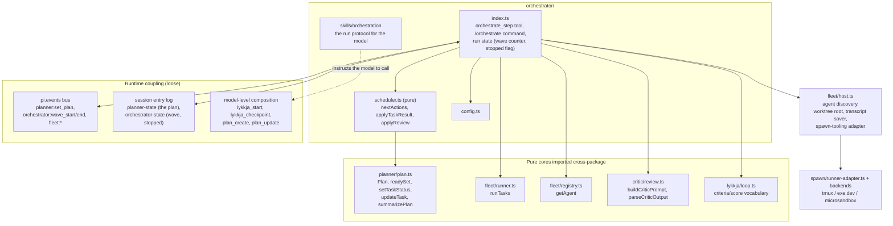
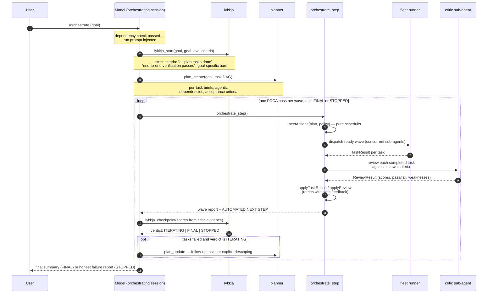
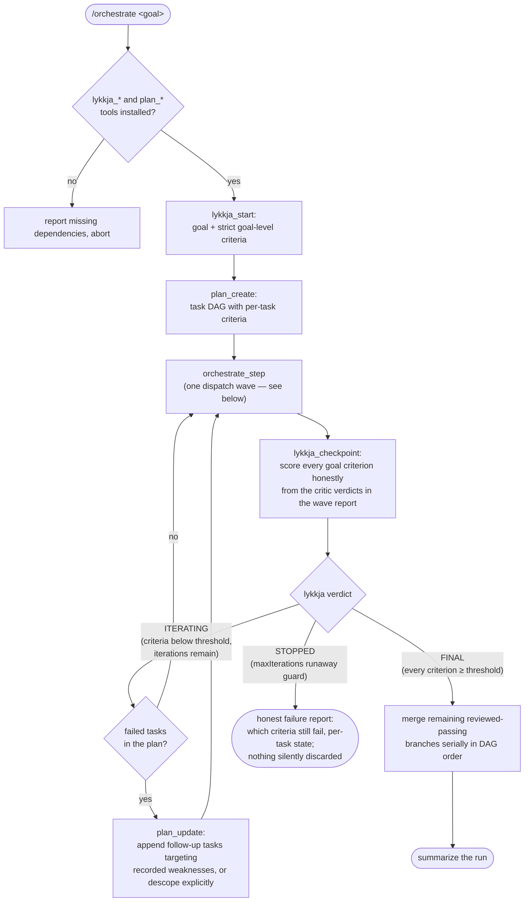
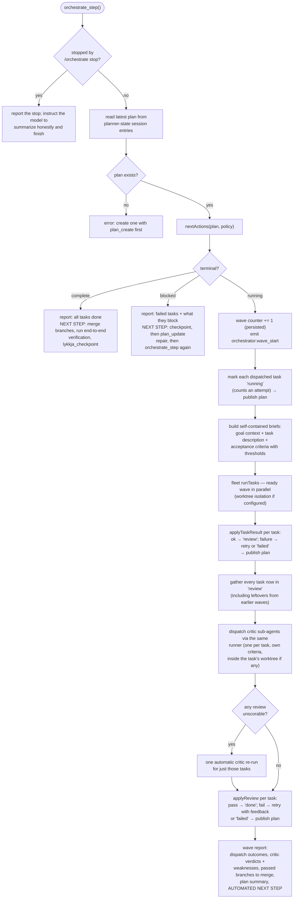
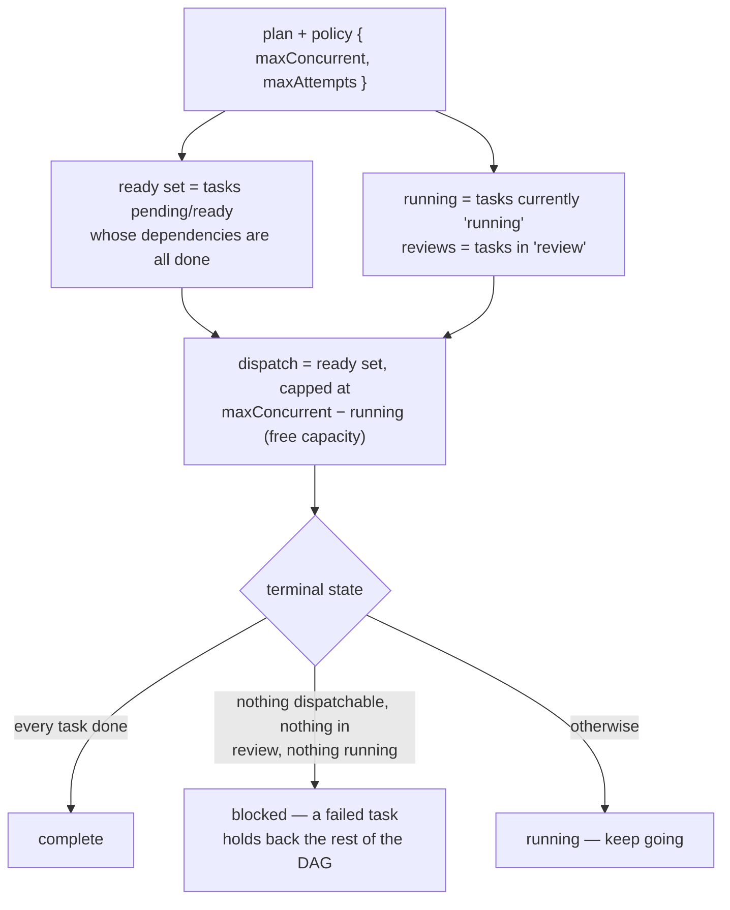
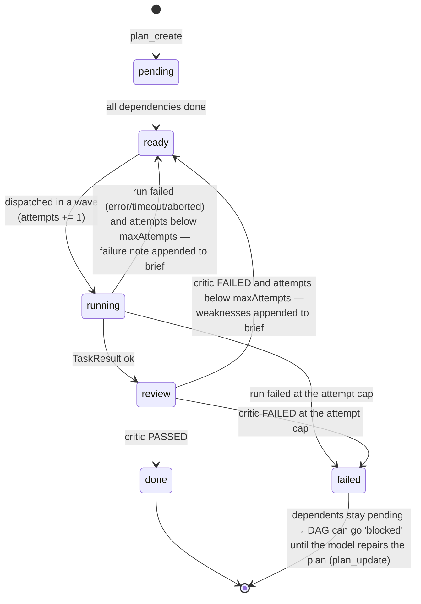
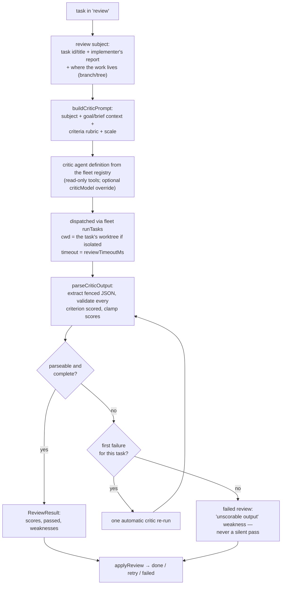
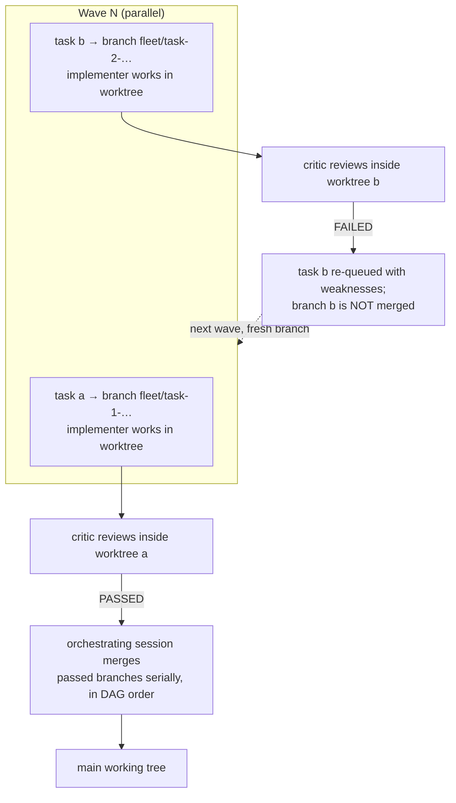
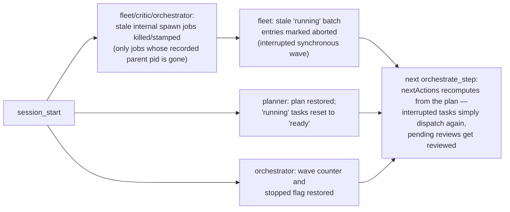

# Orchestrator architecture — how a multi-agent run works

This document explains the internals of [`orchestrator/`](../orchestrator/):
how `/orchestrate` composes the planner, fleet, critic, and lykkja extensions
into one self-driving run, what happens inside a dispatch wave, how the
scheduler state machine decides what to do next, and how retries, reviews,
merges, and failures behave. For installation and configuration, see the
[orchestrator README](../orchestrator/README.md); for the design rationale,
see [multi-agent-orchestration.md](./multi-agent-orchestration.md); for the
sub-agent runtime underneath, see the
[fleet architecture](./fleet-architecture.md); for how waves, sub-agents, and
the PDCA loop realize the Micro-V'ave execution model, see
[micro-vave-execution-model.md](./micro-vave-execution-model.md).

The one-sentence version: **`/orchestrate <goal>` plans the goal as a task
DAG, dispatches waves of concurrent sub-agents, gates every completed task
behind an independent critic review, and drives the whole run inside a lykkja
PDCA loop until an explicit, measurable bar is met — or stops honestly at a
hard cap.**

## Contents

- [Separation of concerns](#separation-of-concerns)
- [Composition architecture](#composition-architecture)
- [The goal loop: a full run end to end](#the-goal-loop-a-full-run-end-to-end)
- [The outer PDCA loop](#the-outer-pdca-loop)
- [Anatomy of one wave: inside `orchestrate_step`](#anatomy-of-one-wave-inside-orchestrate_step)
- [The scheduler state machine](#the-scheduler-state-machine)
- [Plan-task lifecycle and the retry loop](#plan-task-lifecycle-and-the-retry-loop)
- [The critic gate](#the-critic-gate)
- [Self-prompting: why the run never stalls](#self-prompting-why-the-run-never-stalls)
- [Worktree mode: parallel writers and merges](#worktree-mode-parallel-writers-and-merges)
- [Terminal states, failures, and recovery](#terminal-states-failures-and-recovery)
- [Run control: `/orchestrate status` and `stop`](#run-control-orchestrate-status-and-stop)

## Separation of concerns

The orchestrator owns **control flow only**. Hard, deterministic decisions
(waves, retries, terminal states) live in code; judgment (decomposition,
scoring, plan repair) stays with models. Every other concern is delegated to
the extension that owns it:

| Concern | Owner | Mechanism |
|---|---|---|
| Stopping rule, iteration cap | **lykkja** | The run *is* one lykkja PDCA loop; `lykkja_checkpoint` verdicts decide continue-vs-stop |
| The plan as data | **planner** | Validated task DAG with per-task, lykkja-shaped acceptance criteria |
| Execution | **fleet + spawn** | Waves of concurrent sub-agents via fleet's runner, with labeled child execution delegated to spawn backends |
| Judgment on results | **critic** | Fresh-context review of every completed task against its own criteria |
| Wave/retry/terminal mechanics | **orchestrator** | `scheduler.ts`, a pure deterministic state machine |
| Decomposition, checkpoint scoring, plan repair | **the model** | Guided by the `orchestration`, `plan-decomposition`, and `success-criteria` skills |

## Composition architecture

The orchestrator imports only **pure cores** across packages — never another
extension's `index.ts` — plus fleet's `host.ts` for discovery and the
spawn-tooling runner adapter. Runtime coordination with the planner extension happens over the
shared event bus and the session entry log:

Three coupling rules follow from this picture:

1. **The plan is read, never owned.** `orchestrate_step` reads the latest
   plan from the `planner-state` session entries and hands every mutation
   back to the planner extension by emitting `planner:set_plan` — so `/plan`
   dashboards, persistence, and planner events keep working untouched.
2. **lykkja and planner tools are composed at the model level.** The
   orchestrator never calls `lykkja_start` or `plan_create` itself; it
   instructs the model to. `/orchestrate` verifies up front that
   `lykkja_start`, `lykkja_checkpoint`, `plan_create`, and `plan_update` are
   registered, and reports what is missing instead of failing mid-run.
3. **Reviews ride the same runner as implementation tasks.** The critic is
   just another fleet agent definition dispatched through `runTasks` — same
   timeouts, same selected spawn backend, same output discipline.

## The goal loop: a full run end to end

`/orchestrate <goal>` does not run the orchestration itself — it seeds the
session with a run prompt (via `pi.sendUserMessage`) that walks the model
through the protocol defined in the `orchestration` skill. Everything after
that is self-prompting.

## The outer PDCA loop

The run is one lykkja loop; every dispatch wave is one Plan-Do-Check-Act
pass. The model supplies judgment at exactly two points — checkpoint scoring
and plan repair — and the lykkja verdict is the only thing that ends the run:

Defaults that shape the loop (from lykkja): criteria are scored 0–10 with a
pass threshold of 8, and the loop hard-stops after 25 passes. The skill's
standing orders to the model: *the critic's verdicts are the CHECK — never
your own optimism* — and *do not implement plan tasks yourself; sub-agents do
the work*.

## Anatomy of one wave: inside `orchestrate_step`

`orchestrate_step` takes no parameters — all of its input is the persisted
plan plus config. One call performs dispatch **and** review, folds the
results into the plan, publishes the updated plan back to the planner, and
returns a report that ends with the next instruction:

Two details are easy to miss and matter:

- **Review is not tied to this wave's dispatch.** After folding in dispatch
  results, the step reviews *every* task whose status is `review` — including
  tasks completed in an earlier wave whose review didn't happen (e.g. after
  an abort). This is part of what makes the step idempotent and resumable.
- **The sub-agent's self-report is informational only.** It is embedded in
  the review subject for the critic to check, but only the critic's parsed
  verdict moves a task to `done`.

## The scheduler state machine

`scheduler.ts` is the deterministic core — pure functions over the planner's
plan model, fully unit-tested, with no I/O. `nextActions` computes one
decision from the current plan and policy:

The other two functions fold results back into the plan (returning a new
plan; nothing is mutated):

- **`applyTaskResult(plan, id, result, policy)`** — `ok` moves the task to
  `review`. Any other status (`error`, `timeout`, `aborted`) appends a
  failure note to the task's description (so the next attempt sees what
  happened) and re-queues it as `ready` while `attempts < maxAttempts`,
  otherwise marks it `failed`.
- **`applyReview(plan, id, review, policy)`** — a passing review moves the
  task to `done`. A failing review appends the critic's weakness list to the
  brief ("Fix these weaknesses, worst first: …") and re-queues or fails by
  the same attempt rule. It refuses to score a task that is not in `review`.

Attempt counting lives in the planner model: the transition to `running`
increments `attempts`, so failed runs and failed reviews both consume the
same per-task budget (`maxAttempts`, default 2).

## Plan-task lifecycle and the retry loop

Putting the scheduler and the plan model together, every task moves through
this state machine:

The **retry-with-feedback** edge is the quality mechanism: a re-dispatched
task is not a blind rerun. Its brief now carries either the failure note
("Attempt 1 timeout: …") or the critic's prioritized weaknesses, so the next
sub-agent starts from what went wrong. And because a `failed` task never
satisfies its dependents' `dependsOn`, failure is contained: the DAG holds
dependents back, the run reports `blocked`, and repair is an explicit,
model-level act (`plan_update` appending follow-up tasks or descoping) — not
something the scheduler does silently.

## The critic gate

Every completed task is scored by an independent, fresh-context critic
against *that task's own* acceptance criteria — the same lykkja-shaped
criteria the planner attached at decomposition time.

Properties by construction:

- **The critic wins.** Its parsed scores are the only CHECK input; the
  sub-agent's self-report cannot pass its own work.
- **Unparseable never means pass.** A review that cannot be parsed gets one
  automatic re-run, then counts as a failed review with an explicit
  "unscorable output" weakness.
- **The rubric is the task's contract.** Criteria written at planning time
  are exactly what gets scored — one shared vocabulary
  (lykkja's `Criterion`/`CriterionScore`) from plan to review to checkpoint.

## Self-prompting: why the run never stalls

Between `/orchestrate <goal>` and the final summary, no user turns are
needed. The mechanism is the same one lykkja uses: **every tool result ends
with an explicit AUTOMATED NEXT STEP** telling the model exactly what to call
next —

- a normal wave report → "call `lykkja_checkpoint` now, scoring from the
  critic verdicts above; on ITERATING call `orchestrate_step` again (repair
  the plan first if tasks failed); on FINAL merge and summarize; on STOPPED
  report honestly";
- a `complete` terminal → "merge unmerged branches in DAG order, run the
  goal-level end-to-end verification, then checkpoint";
- a `blocked` terminal → "checkpoint honestly, then repair with
  `plan_update`, then step again";
- a stop → "do not dispatch further waves; report the current state".

The model never has to remember the protocol mid-run; the protocol is
delivered to it at every step, and the skill supplies the judgment rules
(score honestly, never inflate to end the run, don't do the tasks yourself).

## Worktree mode: parallel writers and merges

With `isolation: "worktree"` (config), each dispatched task runs on its own
branch in its own git worktree, and the critic reviews **inside that
worktree**. Only branches that passed review are merged — serially, in DAG
order, by the orchestrating session itself, never by the runner:

Merge policy (from the `orchestration` skill): resolve trivial conflicts in
the orchestrating session; dispatch a dedicated fleet task for messy ones. A
merge conflict is treated as a review failure — the conflict is recorded as
the weakness and the normal retry path handles it. For small runs the default
`isolation: "none"` with disjoint per-task file scopes (a planning concern)
is simpler and preferred.

## Terminal states, failures, and recovery

Every failure mode has a defined, honest behavior — nothing is silently
discarded:

| Failure | Behavior |
|---|---|
| Task timeout / child crash | Failed attempt; failure note appended to the brief; retried up to `maxAttempts`, then `failed` |
| Partial wave failure | Completed tasks still proceed to review; the DAG holds back dependents of failed tasks; `blocked` surfaces the blockers for plan repair |
| Critic output unparseable | One automatic re-run, then a failed review with an "unscorable output" weakness |
| Critic vs. sub-agent disagreement | The critic wins by construction — it is the only source of CHECK scores |
| lykkja `STOPPED` (25-pass cap) | Hard stop with a per-criterion, per-task failure report and any unmerged branches listed |
| `/orchestrate stop` | The next `orchestrate_step` reports the stop instead of dispatching |
| Session restart mid-run | See below — the next `orchestrate_step` resumes idempotently |
| User abort (`ctx.signal`) | The runner aborts queued tasks and asks the spawn adapter to kill/stamp running spawn jobs; state entries record it |

Restart recovery is a three-layer handshake, each layer repairing its own
state from the session entry log:

Because `orchestrate_step` derives everything from the persisted plan, "crash
anywhere, call it again" is the recovery story — there is no separate resume
path.

## Run control: `/orchestrate status` and `stop`

- **`/orchestrate status`** (or bare `/orchestrate`) prints the wave counter,
  policy (concurrency, attempts, isolation), selected spawn backend / tmux
  session, plan progress, and a dependency check for the required
  lykkja/planner tools.
- **`/orchestrate stop`** sets a persisted `stopped` flag. It does not kill
  anything mid-flight: the *next* `orchestrate_step` call reports the stop
  instead of dispatching, and instructs the model to summarize the plan state
  honestly. Starting a new run (`/orchestrate <goal>`) clears the flag and
  resets the wave counter.
- **Watching live**: with spawn's `tmux` backend selected, every implementer
  and critic sub-agent runs in the shared `pi-agents` session —
  `tmux attach -t pi-agents` — while `/plan` shows the live DAG. Other spawn
  backends are polled through their logs/status APIs.
