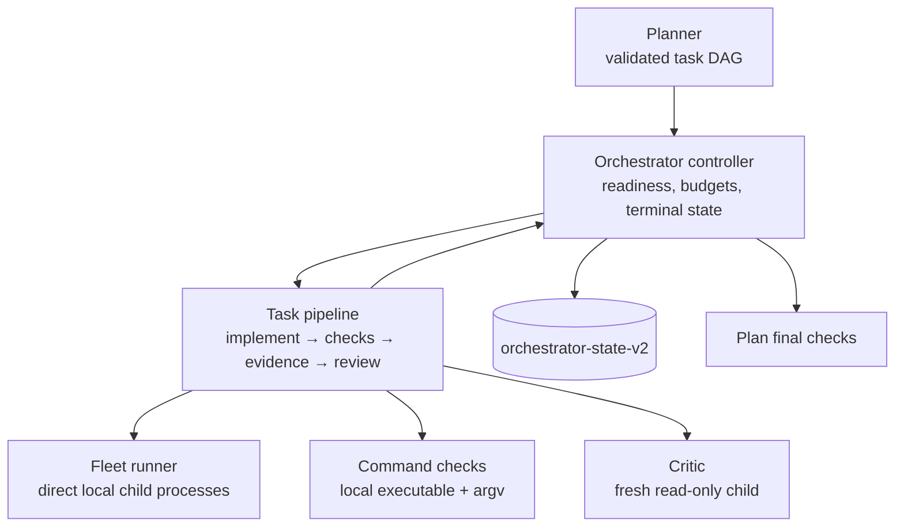
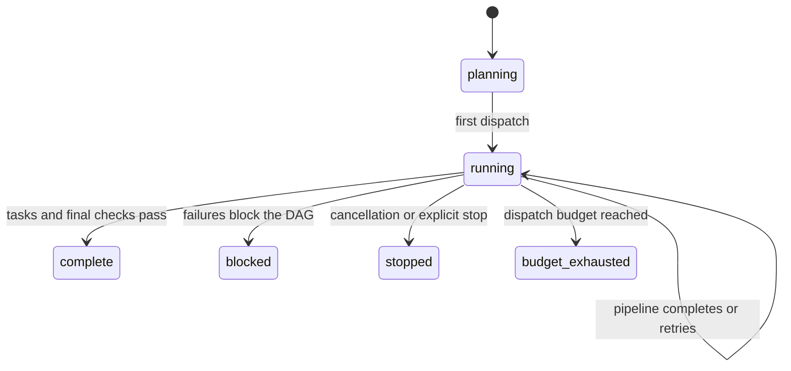

# Orchestrator architecture

Orchestrator composes Planner plans, Fleet execution, deterministic command
checks, optional evidence, and independent Critic review into a restart-safe
controller. It owns execution state; Planner remains the plan-building UI and
receives a read-only projection while a run is active.

## Components


```mermaid
flowchart TB
  planner["Planner\nvalidated task DAG"]
  controller["Orchestrator controller\nreadiness, budgets, terminal state"]
  pipeline["Task pipeline\nimplement → checks → evidence → review"]
  fleet["Fleet runner\ndirect local child processes"]
  checks["Command checks\nlocal executable + argv"]
  critic["Critic\nfresh read-only child"]
  state[("orchestrator-state-v2")]
  final["Plan final checks"]

  planner --> controller
  controller --> pipeline
  pipeline --> fleet
  pipeline --> checks
  pipeline --> critic
  pipeline --> controller
  controller --> state
  controller --> final
```

All implementation, evidence, and review agents use Fleet's single direct
local process adapter. Command checks run directly through `execFile`-style
executable/argument contracts rather than an implicit shell.

## Plan contract

A plan contains:

- a goal;
- tasks with stable IDs, descriptions, dependencies, roles, criteria, and
  optional checks;
- bounded attempt feedback and artifacts; and
- goal-level final checks.

Planner validates IDs, dependency cycles, statuses, criteria, check commands,
timeouts, and repository-relative check directories. A plan can be replaced or
revised before first dispatch. Once execution begins, Orchestrator is the
authoritative owner and Planner displays an observational projection.

## Controller loop

`orchestrate_step` drains ready pipelines and can start dependents that become
ready during the same invocation. `orchestrate_run` uses the same controller
but continues through final acceptance.


```mermaid
stateDiagram-v2
  [*] --> planning
  planning --> running: first dispatch
  running --> running: pipeline completes or retries
  running --> complete: tasks and final checks pass
  running --> blocked: failures block the DAG
  running --> stopped: cancellation or explicit stop
  running --> budget_exhausted: dispatch budget reached
```

The controller repeatedly:

1. restores or adopts the current state;
2. computes ready tasks whose dependencies and branch prerequisites are
   satisfied;
3. reserves attempts and stable run identities;
4. runs up to `maxConcurrent` pipelines;
5. reduces outcomes into the latest authoritative state;
6. persists the transition and recalculates readiness; and
7. runs final checks once when all tasks are done.

A dispatch budget bounds one controller invocation. Cancellation stops new
dispatch and leaves undispatched work resumable.

## Per-task pipeline

The default `per-task` mode applies concurrency to whole pipelines:

```text
implementation
  → deterministic task checks
  → optional evidence agent
  → optional critic review
  → worktree commit and artifacts
  → done | retry | failed | aborted
```

A failed implementation or check skips later phases. `reviewMode: "none"`
skips semantic review but does not skip declared checks. Evidence is disabled
unless an `evidenceAgent` is configured.

`barrier` mode is a compatibility path that completes each phase across a
bounded wave before moving to the next phase.

## Attempts and feedback

Attempts increment only when a child is actually launched. Execution,
check, review, integration, and commit failures become bounded structured
feedback. Task descriptions remain immutable after dispatch. Feedback retains
only the newest entries and is byte-capped before entering another child
prompt.

A task returns to ready while attempts remain. At `maxAttempts`, it becomes
failed and its unresolved dependents remain blocked. Unrelated branches of the
DAG can continue.

## Worktrees and artifacts

With worktree isolation enabled, each implementation runs on a stable task
branch. Passing checks and review are not enough to unlock dependents: the
branch must also commit successfully and its artifact must be recorded.
Dependencies receive structured artifact references and parent run IDs in
their briefs. Fan-in tasks wait until prerequisite branches are integrated as
required by the handoff policy.

## Critic prompts

Review prompts contain bounded slices of:

- the canonical task criteria;
- the implementation summary;
- deterministic command/exit evidence;
- branch, worktree, transcript, and declared artifact references; and
- optional independent evidence.

Malformed or incomplete critic output fails closed. Critic review never
silently converts an unscorable response into a pass.

## Final checks

Plan `finalChecks` are the primary acceptance gate. They execute at most once
after all tasks complete. A legacy global integration command is used only
when the plan has no final checks and is explicitly configured.

Terminal results distinguish verified completion, required manual branch
integration, blocked work, explicit stopping, and budget exhaustion.

## State and restart recovery

`OrchestratorRunStateV2` persists:

- run ID and status;
- the normalized plan;
- active pipelines;
- compact task outcomes;
- final-check results and status;
- a bounded paired event log; and
- creation/update timestamps.

On restart, completed outcomes remain complete, interrupted pipelines return
to a dispatchable state without consuming an unlaunched attempt, stable
worktrees can be reused, and interrupted final checks reset to `not_started`.
Older Planner snapshots migrate once into V2 state.

## Reporting

Tool details use a compact versioned summary rather than embedding complete
child transcripts. Each task summary carries status, duration, attempt,
optional branch/transcript references, check summary, and review result. Full
JSONL transcripts remain available by path.

## Control modes

Deterministic control is the default and requires only Planner tools. An
optional PDCA compatibility mode can request parent-level checkpoints; it does
not change the task pipeline or child-process runtime.

## Verification

`orchestrator/test.ts` and `orchestrator/runtime.test.ts` cover scheduler
transitions, concurrent pipelines, retries, checks, barriers, worktree
artifacts, bounded prompts/details, final acceptance, cancellation, event
pairing, dispatch identities, migration, and restart recovery.
