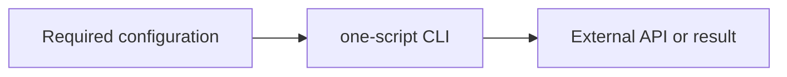

# Skill name



One short paragraph: what the skill does, its runtime requirement, and where
the bundled zero-dependency script lives.

## Configuration

| Variable | Required | Purpose |
| --- | --- | --- |
| `EXAMPLE_API_KEY` | yes | Authentication; never print it |

## Commands

```sh
node {baseDir}/skill-name.mjs "input" --limit 10 --json
```

| Flag | Meaning |
| --- | --- |
| `--limit <n>` | bounded result count |
| `--json` | raw JSON output |

## Safety

- State what must be confirmed before writes or destructive actions.
- Keep credentials in environment variables, never command arguments.
- Explain API failures plainly; never automatically retry mutations.

New skills must keep this one-page shape: one diagram, one `SKILL.md`, one
zero-dependency script when code is needed, and one focused test included in
the root `npm test` command. Add required variables to `skills/doctor.mjs`.
