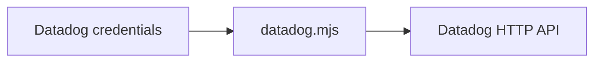

# Datadog CLI



Use the bundled zero-dependency Node.js CLI to interact with Datadog. It
requires Node.js 18.18 or newer.

## Configuration

| Variable | Required | Purpose |
| --- | --- | --- |
| `DD_API_KEY` | yes | Datadog API key |
| `DD_APP_KEY` | yes | Datadog application key |
| `DD_SITE` | no | Datadog site parameter; defaults to `datadoghq.com` (US1) |

Supported `DD_SITE` values are `datadoghq.com`, `us3.datadoghq.com`,
`us5.datadoghq.com`, `datadoghq.eu`, `ap1.datadoghq.com`,
`ap2.datadoghq.com`, `uk1.datadoghq.com`, `ddog-gov.com`, and
`us2.ddog-gov.com`. Use the site parameter shown in Datadog **My Preferences**,
not the full app or API URL.

## Commands

Treat options as command-specific. The CLI rejects every unexpected argument.
These are the complete supported signatures:

```text
validate
monitor <id>
monitors [--limit <n>] [--page <n>] [--name <text>] [--tags <csv>] [--monitor-tags <csv>] [--group-states <csv>] [--with-downtimes <true|false>] [--id-offset <id>]
search-monitors <query> [--limit <n>] [--page <n>] [--sort <field,direction>]
create-monitor <name> <type> <query> [--message <text>] [--tags <csv>] [--options <json|@file>] [--data <json|@file>]
validate-monitor <name> <type> <query> [--message <text>] [--tags <csv>] [--options <json|@file>] [--data <json|@file>]
update-monitor <id> --data <json|@file>
request <method> <path> [--data <json|@file>]
```

Examples:

```sh
node {baseDir}/datadog.mjs validate
node {baseDir}/datadog.mjs monitor 12345678
node {baseDir}/datadog.mjs monitors --monitor-tags 'team:checkout' --limit 50
node {baseDir}/datadog.mjs search-monitors 'type:metric status:alert' --limit 25
node {baseDir}/datadog.mjs validate-monitor 'High CPU' 'metric alert' 'avg(last_5m):avg:system.cpu.user{env:prod} > 90' --options '{"thresholds":{"critical":90}}'
node {baseDir}/datadog.mjs create-monitor 'High CPU' 'metric alert' 'avg(last_5m):avg:system.cpu.user{env:prod} > 90' --message 'Notify @ops' --tags 'team:ops,env:prod' --options '{"thresholds":{"critical":90}}'
node {baseDir}/datadog.mjs update-monitor 12345678 --data '{"message":"Notify @ops-on-call"}'
```

`monitors` and `search-monitors` default to page 0 with 50 results and cap
`--limit` at 1000. `--data` and `--options` accept JSON directly or
`@path/to/file.json`. For `create-monitor` and `validate-monitor`, explicit
arguments override the same fields in `--data`.

Use `request` for APIs not covered by a convenience command, including logs,
metrics, dashboards, SLOs, incidents, and synthetics. Its path is relative to
the configured Datadog API origin and cannot send credentials to another host:

```sh
node {baseDir}/datadog.mjs request GET '/api/v1/dashboard'
node {baseDir}/datadog.mjs request POST '/api/v2/logs/events/search' --data '{"filter":{"query":"service:checkout status:error"},"page":{"limit":25}}'
node {baseDir}/datadog.mjs request GET '/api/v1/query?from=1725148800&to=1725152400&query=avg:system.cpu.user{env:prod}'
```

Commands print Datadog's JSON response to stdout. Requests time out after 30
seconds. Use `--` before positional text that begins with `--`.

## Safety

- Read a monitor immediately before changing it. Validate a proposed monitor
  before creating it. Before an update, merge the requested fields into the
  freshly fetched monitor definition and validate that complete body, including
  `query` and `type`, against `/api/v1/monitor/<id>/validate`; then send only
  the requested fields to `update-monitor`.
- Only mutate Datadog when the user clearly requested the exact change. Ask for
  confirmation before bulk changes, deletion, or muting unless explicitly
  requested.
- Never print or pass either credential as a command-line argument.
- Report API errors plainly and never automatically retry a mutating request.
