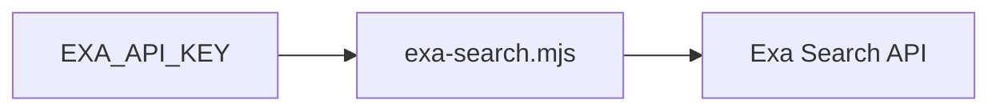

# Exa web search



Run a web search through Exa with the bundled zero-dependency Node script.
Requires Node.js 18 or newer.

## Configuration

| Variable | Required | Purpose |
| --- | --- | --- |
| `EXA_API_KEY` | yes | Exa API key from https://dashboard.exa.ai/api-keys |
| `EXA_BASE_URL` | no | API endpoint; defaults to `https://api.exa.ai` |

## Commands

```sh
node {baseDir}/exa-search.mjs "your search query"
```

Useful options:

| Flag | Meaning |
| --- | --- |
| `--limit <n>` | number of results, 1-100 (default 5) |
| `--type <t>` | `auto`, `neural`, `keyword`, `fast`, `deep`, `deep-reasoning`, `instant` (default `auto`) |
| `--category <c>` | filter, e.g. `news`, `"research paper"`, `github`, `company`, `pdf` |
| `--include-domains a,b` / `--exclude-domains a,b` | domain filters |
| `--start-date` / `--end-date <iso>` | publish-date range |
| `--max-chars <n>` | page text per result, `0` disables text (default 1000) |
| `--json` | raw JSON response instead of formatted text |

Examples:

```sh
node {baseDir}/exa-search.mjs "state of WebGPU adoption" --limit 8 --category news --start-date 2026-01-01
node {baseDir}/exa-search.mjs "rust async runtime comparison" --include-domains github.com --json
```

`--num` remains accepted as a compatibility alias for `--limit`.

## Safety

- Results include the page text (capped at `--max-chars`) so you can usually
  answer from the output without fetching pages separately.
- Cite result URLs when reporting findings to the user.
- If the script exits with an API error, report it plainly; do not retry more
  than once.
- Never print `EXA_API_KEY`.
