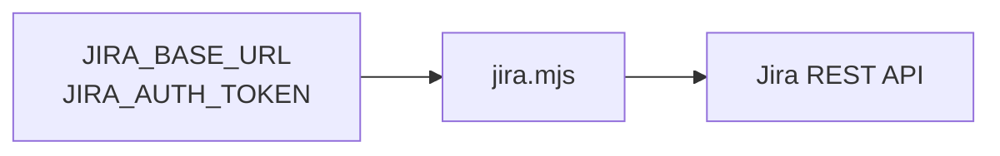

# Jira CLI



Use the bundled zero-dependency Node.js CLI to interact with Jira Cloud or
self-hosted Jira Server/Data Center. It requires Node.js 18 or newer.

## Configuration

| Variable | Required | Purpose |
| --- | --- | --- |
| `JIRA_BASE_URL` | yes | Jira site or server URL |
| `JIRA_AUTH_TOKEN` | yes | API token or personal access token |
| `JIRA_EMAIL` | Cloud only | Selects Basic authentication with an API token |
| `JIRA_API_VERSION` | no | Force REST API `2` or `3` |

For Jira Cloud, set the account email as well:

```sh
export JIRA_BASE_URL="https://company.atlassian.net"
export JIRA_EMAIL="user@example.com"
export JIRA_AUTH_TOKEN="..."
```

For Jira Server/Data Center, omit `JIRA_EMAIL`; the CLI sends the personal
access token as a Bearer token. The CLI does not support Jira Cloud OAuth
access tokens.

The CLI detects Jira Cloud and uses REST API v3; it uses v2 for Server/Data
Center. Set `JIRA_API_VERSION=2` or `JIRA_API_VERSION=3` only when detection is
unavailable or an administrator requires a specific API version.

## Commands

```sh
node {baseDir}/jira.mjs issue ABC-123
node {baseDir}/jira.mjs search 'project = ABC AND status != Done' --limit 20
node {baseDir}/jira.mjs projects
node {baseDir}/jira.mjs create ABC Task 'Investigate login failures'
node {baseDir}/jira.mjs create ABC Bug 'Login fails' --description 'Steps...' --fields '{"priority":{"name":"High"}}'
node {baseDir}/jira.mjs update ABC-123 --fields '{"summary":"Updated summary"}'
node {baseDir}/jira.mjs comment ABC-123 'Investigation is complete.'
node {baseDir}/jira.mjs transitions ABC-123
node {baseDir}/jira.mjs transition ABC-123 31
```

Search options are `--limit <n>`, `--fields <comma-separated names>`,
`--start-at <n>` for self-hosted pagination, and `--next-page-token <token>`
for Cloud pagination. Platform-specific pagination options are rejected when
used with the wrong Jira deployment. Commands print Jira's JSON response to
stdout. Requests time out after 30 seconds.

Use `request` for API operations not covered by a convenience command. Its path
is relative to `JIRA_BASE_URL` and should include the REST API version:

```sh
node {baseDir}/jira.mjs request GET /rest/api/2/myself
node {baseDir}/jira.mjs request POST /rest/api/3/issue/ABC-123/watchers --data '"account-id"'
node {baseDir}/jira.mjs request PUT /rest/api/2/issue/ABC-123 --data @payload.json
```

`--data` and `--fields` accept JSON directly or `@path/to/file.json`.
Use `--` before positional text that begins with `--`, for example:

```sh
node {baseDir}/jira.mjs comment ABC-123 -- '--blocked--'
```

## Safety

- Read the issue immediately before changing it and report the issue key and
  resulting change.
- Ask for confirmation before bulk edits, issue deletion, or destructive
  transitions unless the user explicitly requested that exact action.
- Never print or pass the authentication token as a command-line argument.
- On an API error, report the status and Jira error response; do not retry a
  mutating request automatically.
