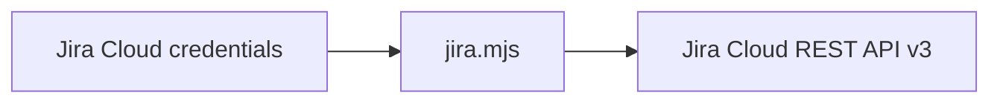

# Jira CLI



Use the bundled zero-dependency Node.js CLI to interact with Jira Cloud. It
requires Node.js 18 or newer.

## Configuration

The CLI accepts exactly two Jira Cloud API base URL forms.

| Variable | Required | Purpose |
| --- | --- | --- |
| `JIRA_BASE_URL` | yes | HTTPS Jira Cloud API base URL |
| `JIRA_EMAIL` | yes | Atlassian account email |
| `JIRA_AUTH_TOKEN` | yes | Atlassian API token |

For an API token without scopes, use the Jira site URL:

```sh
export JIRA_BASE_URL="https://company.atlassian.net"
export JIRA_EMAIL="user@example.com"
export JIRA_AUTH_TOKEN="..."
```

For an API token with scopes, including a service-account token, use the
Atlassian API gateway URL. Replace `<cloudId>` with the site's Cloud ID:

```sh
export JIRA_BASE_URL="https://api.atlassian.com/ex/jira/<cloudId>"
export JIRA_EMAIL="service-account@example.com"
export JIRA_AUTH_TOKEN="..."
```

Find the Cloud ID at
`https://company.atlassian.net/_edge/tenant_info` and use the returned
`cloudId` value, not the organization ID. Do not append `/rest/api/3`; the CLI
adds API paths itself. The CLI uses Basic authentication with the email and API
token. It does not support OAuth access tokens.

## Commands

```sh
node {baseDir}/jira.mjs issue ABC-123
node {baseDir}/jira.mjs search 'project = ABC AND status != Done' --limit 20
node {baseDir}/jira.mjs projects
node {baseDir}/jira.mjs create ABC Task 'Investigate login failures'
node {baseDir}/jira.mjs create ABC Bug 'Login fails' --description 'Steps...' --fields '{"priority":{"name":"High"}}'
node {baseDir}/jira.mjs update ABC-123 --fields '{"summary":"Updated summary"}'
node {baseDir}/jira.mjs comment ABC-123 'Investigation is complete.'
node {baseDir}/jira.mjs transitions ABC-123
node {baseDir}/jira.mjs transition ABC-123 31
```

Search options are `--limit <n>` for the page size,
`--fields <comma-separated names>`, and `--next-page-token <token>`. Commands
print Jira's JSON response to stdout. Requests time out after 30 seconds.

Use `request` for API operations not covered by a convenience command. Its path
is relative to `JIRA_BASE_URL`, must remain beneath that base URL, and should
include the REST API version:

```sh
node {baseDir}/jira.mjs request GET /rest/api/3/myself
node {baseDir}/jira.mjs request POST /rest/api/3/issue/ABC-123/watchers --data '"account-id"'
node {baseDir}/jira.mjs request PUT /rest/api/3/issue/ABC-123 --data @payload.json
```

For `create` and `update`, `--fields` accepts JSON directly or
`@path/to/file.json`. The `request` command's `--data` option accepts either
form as well.
Use `--` before positional text that begins with `--`, for example:

```sh
node {baseDir}/jira.mjs comment ABC-123 -- '--blocked--'
```

## Safety

- Read the issue immediately before changing it and report the issue key and
  resulting change.
- Ask for confirmation before bulk edits, issue deletion, or destructive
  transitions unless the user explicitly requested that exact action.
- Never print or pass the authentication token as a command-line argument.
- On an API error, report the status and Jira error response; do not retry a
  mutating request automatically.
