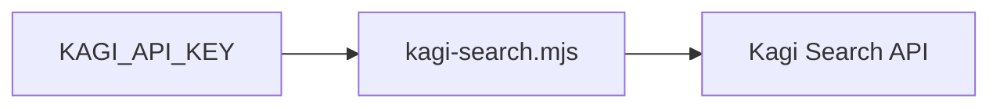

# Kagi web search



Run a web search through Kagi with the bundled zero-dependency Node script.
Requires Node.js 18 or newer.

## Configuration

| Variable | Required | Purpose |
| --- | --- | --- |
| `KAGI_API_KEY` | yes | Kagi token from https://kagi.com/settings?p=api |
| `KAGI_BASE_URL` | no | API endpoint; defaults to `https://kagi.com/api/v1` |

Set `KAGI_BASE_URL` to a legacy v0 endpoint only for a legacy API key.

## Commands

```sh
node {baseDir}/kagi-search.mjs "your search query"
```

Useful options:

| Flag | Meaning |
| --- | --- |
| `--limit <n>` | number of results, 1-100 (default 10) |
| `--related` | include Kagi's "related searches" suggestions |
| `--json` | raw JSON response instead of formatted text |

Examples:

```sh
node {baseDir}/kagi-search.mjs "postgres logical replication pitfalls" --limit 5
node {baseDir}/kagi-search.mjs "browser security changes" --limit 10 --json
```

## Safety

- Kagi returns titles, URLs, and short snippets; fetch a result page yourself
  when you need more than the snippet.
- Cite result URLs when reporting findings to the user.
- If the script exits with an API error, report it plainly; do not retry more
  than once.
- Never print `KAGI_API_KEY`.
