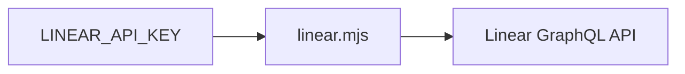

# Linear



Use the bundled zero-dependency Node CLI to interact with Linear's GraphQL API.
It requires Node.js 18 or newer.

## Configuration

| Variable | Required | Purpose |
| --- | --- | --- |
| `LINEAR_API_KEY` | yes | Personal API key from **Settings → Security & access** |
| `LINEAR_API_URL` | no | GraphQL endpoint; defaults to `https://api.linear.app/graphql` |

## Read data

```sh
node {baseDir}/linear.mjs viewer
node {baseDir}/linear.mjs teams --limit 50
node {baseDir}/linear.mjs users --limit 50
node {baseDir}/linear.mjs projects --limit 50
node {baseDir}/linear.mjs states --limit 100
node {baseDir}/linear.mjs labels --limit 100
node {baseDir}/linear.mjs issues --limit 25
node {baseDir}/linear.mjs issues --team TEAM_UUID --limit 25
node {baseDir}/linear.mjs search-issues 'login crash' --limit 25
node {baseDir}/linear.mjs issue ENG-123
node {baseDir}/linear.mjs comments ENG-123 --limit 50
```

List commands and `comments` accept `--limit <1-250>` and `--after <cursor>`.
Their JSON output includes `pageInfo`; pass `pageInfo.endCursor` to `--after`
when `pageInfo.hasNextPage` is true. `comments` can retrieve every comment page
after the first 50 returned by `issue`.

`teams`, `users`, `projects`, `states`, `labels`, `issues`, and `search-issues`
accept `--filter '<json>'` using Linear's corresponding GraphQL filter input.
Prefer server-side filters and `search-issues` over fetching whole collections
and filtering locally:

```sh
node {baseDir}/linear.mjs users --filter '{"name":{"containsIgnoreCase":"alex"}}'
node {baseDir}/linear.mjs issues --filter '{"state":{"type":{"eq":"started"}}}'
```

## Create and modify issues

Only run a mutation when the user has clearly requested that Linear be changed.
Read teams, users, states, projects, and labels first when their UUIDs are not
known.

```sh
node {baseDir}/linear.mjs create-issue --team TEAM_UUID --title "Fix login redirect" --description "Details in Markdown"
node {baseDir}/linear.mjs update-issue ENG-123 --state STATE_UUID --assignee USER_UUID
node {baseDir}/linear.mjs comment ISSUE_UUID --body "The fix is ready for review."
```

`issue` and `update-issue` accept either a UUID or an identifier such as
`ENG-123`. `comment` requires the issue UUID; run `issue ENG-123` first to
resolve it.

`create-issue` and `update-issue` support these fields:

| Flag | Linear input field |
| --- | --- |
| `--title <text>` | `title` |
| `--description <markdown>` | `description` |
| `--state <uuid>` | `stateId` |
| `--assignee <uuid>` | `assigneeId` |
| `--project <uuid>` | `projectId` |
| `--priority <0-4>` | `priority` |
| `--due-date <YYYY-MM-DD>` | `dueDate` |
| `--labels <uuid,uuid>` | `labelIds` |

Pass `--input '<json>'` to either command for other fields accepted by Linear's
`IssueCreateInput` or `IssueUpdateInput`. Explicit flags override fields in that
JSON object.

## Custom GraphQL

Use `graphql` when a built-in command does not expose the required Linear data
or mutation:

```sh
node {baseDir}/linear.mjs graphql --query 'query($id:String!){ issue(id:$id){ id identifier title } }' --variables '{"id":"ENG-123"}'
node {baseDir}/linear.mjs graphql --file /tmp/operation.graphql --variables-file /tmp/variables.json
```

The CLI prints the GraphQL `data` object as formatted JSON. It exits nonzero and
prints all GraphQL errors when the API returns any. Never print or expose the
value of `LINEAR_API_KEY`. Requests time out after 30 seconds.

## Safety

- Only mutate Linear when the user clearly requested the exact change.
- Resolve human-readable names to current UUIDs before a mutation.
- Report API errors plainly and never automatically retry a mutation.
