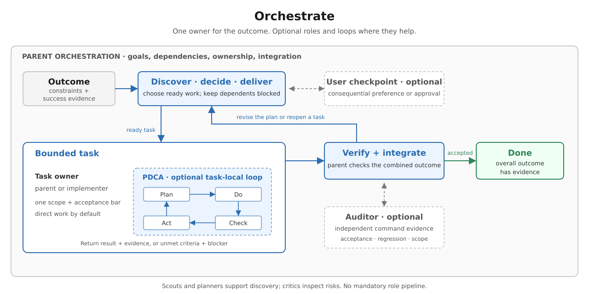

# Orchestrate

Own the outcome with the smallest useful workflow. Work directly by default;
roles are options, not a mandatory pipeline. No configuration or script is
required.

[PDCA](../pdca/SKILL.md) is an optional loop **inside a bounded task**, including
an integration fix, when iteration against an explicit quality bar is useful.
Orchestration owns the goal, dependencies, task owners, and acceptance of the
combined result. PDCA owns improvements to that task's result; its “done” does
not complete the whole workflow. The parent accepts the evidence or reopens
work, adding a critic or auditor only when useful. Put any PDCA instructions
and rubric in the child's brief; children do not inherit the parent's skills.

## Establish the goal and next step

- State the outcome, constraints, non-goals, and evidence that would establish
  success. Use observable checks rather than invented 1–10 scores.
- **Discover** when an important fact is unknown: name the question and run the
  smallest useful investigation or experiment. **Decide** when preferences or
  tradeoffs matter: bring concrete alternatives, evidence, and a recommendation.
  **Deliver** when the direction is settled: implement and verify autonomously.
- Choose the next coherent step by uncertainty, risk, and dependencies. Revise
  the plan when evidence changes; do not silently relax acceptance criteria.
- Make reversible, in-scope decisions and state consequential assumptions.
  Involve the user when their preference changes the direction or approval is
  required for external writes, destructive actions, or scope changes. Do not
  request approval for every step or treat this skill as permission to ship.

## Orchestrate tasks

- For coordinated work, keep a short task list in working notes: task id,
  outcome/check, owner, scope, dependencies, status, and evidence. Use
  `pending → running → ready for verification → done`, with `blocked` for work
  that cannot proceed. A single-owner task needs no elaborate task board.
- Dispatch only tasks whose dependencies are done. The tool's `completed`
  status means the child returned, not that its acceptance checks passed.
  Inspect the result and evidence before releasing dependent work.
- Parallelize independent questions or disjoint write scopes. Serialize
  overlapping edits; use existing separate worktrees for parallel writers.
  The parent integrates their changes into the target checkout and checks the
  combined result. Passing checks in separate worktrees do not prove integration.
- After a failure, timeout, or cancellation, inspect partial changes before
  retrying or reassigning. Keep affected dependents blocked. If a later change
  invalidates earlier evidence, reopen the affected checks.
- Preserve successful work. When progress stalls, change the hypothesis or
  report the blocker; do not repeat the same attempt or inflate success claims.

## Delegate with a purpose

Use the Pi `subagent` tool and the [subagents skill](../subagents/SKILL.md) for
its API and limits. If unavailable, do the work directly or report the missing
capability; do not launch shell-based agents. Children have fresh context and
no inherited skills: include needed instructions, not just a skill name.

| Pattern | Use when | Assignment |
| --- | --- | --- |
| Parallel scouts | Independent unknowns block a decision | One question each; return `path:line` evidence. Parent synthesizes. |
| Planner | Dependencies or scope need substantial analysis | Return a grounded decomposition with checks; parent chooses the plan. |
| Implementer | A bounded unit can have a separate owner | Assign scope and acceptance checks; return changes and command evidence. |
| Critic | A specific design or correctness risk needs fresh scrutiny | Inspect the actual result; return concrete findings and consequences. |
| Auditor | Independent execution can test a consequential claim | Run specified checks against the identified checkout and report exact evidence. |

Every brief includes the goal, relevant context/paths, allowed scope, acceptance
checks, dependencies already resolved, and required output. Children must not
delegate further. Avoid delegation for trivial tasks or routine reassurance;
the parent remains responsible for correctness and integration.

## Audit claims, not scores

Implementation includes its own verification. Add an auditor when a separate
check can catch a meaningful mistake; a critic inspects code but cannot run
commands. Choose the pattern that tests the claim:

- **Acceptance audit:** give the auditor the intended behaviour and approved
  test commands, not only the implementer's summary. Check expected outputs and
  boundary cases, not just exit status. Example brief: “In the target checkout,
  verify retries for 429/503 but not 400; run the retry tests; report checkout
  identity, command, exit status, relevant assertions/output, and untested cases.”
- **Regression audit:** for a bug fix, establish that a reproducer fails for the
  expected reason before the change and passes afterward. Without that baseline,
  report only what the current run establishes.
- **Scope audit:** compare the agreed paths with before/after Git status and
  diffs, including staged changes. Without a baseline, report current state;
  tracked-file evidence cannot prove that no transient or ignored writes occurred.

Audits must not edit, install, deploy, or touch shared data. Check commands for
side effects and use disposable local data where needed. The auditor's policy
is instruction-based, not a security sandbox. Findings mean fix and recheck;
an unavailable check is unverified, not a pass.

## Close or hand off

Stop when the outcome has evidence, or name the unresolved blocker and what
would resolve it. Report verified results, limitations, and actual delivery
state: local, committed, pushed, merged, or deployed. For long work, preserve
the goal, decisions, task state, evidence, open questions, and next action in
working notes; create a persistent file only when continuity requires one.
