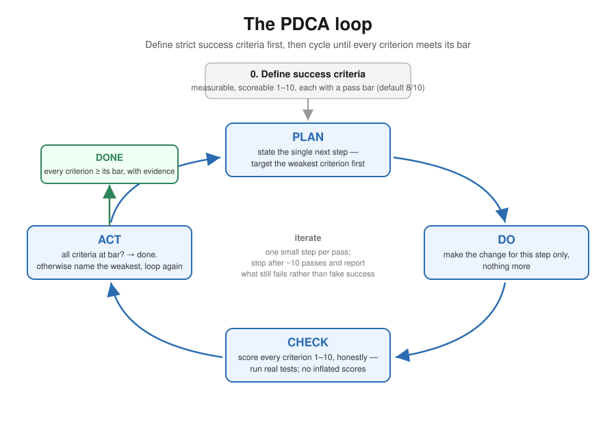

# PDCA

Work the task as a Plan-Do-Check-Act loop. The whole process is in the
diagram — study it and run the loop yourself, keeping the criteria and scores
in your working notes:

In short: define strict, measurable success criteria up front (scoreable 1-10,
default bar 8/10). Then loop — plan one small step targeting the weakest
criterion, do only that step, check by honestly scoring every criterion against
real evidence, and act: declare done only when everything is at its bar,
otherwise iterate. If roughly ten passes don't clear the bar, stop and report
exactly which criteria still fail and why — never inflate a score to escape
the loop.

Skip the loop for trivial single-step tasks; the overhead only pays off when
iteration against an explicit bar adds value.
