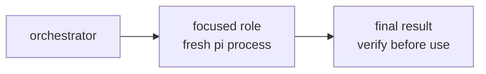
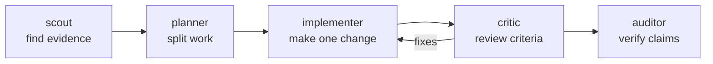

# Sub-agents



Delegate a focused piece of work to a fresh `pi` child process with a role
prompt and a restricted tool set. Each sub-agent starts with no context beyond
its role and the task text you give it, so write self-contained briefs.

## Roles

| Role | What it does | Tools |
| --- | --- | --- |
| `scout` | Read-only exploration; answers one question about a codebase with `path:line` evidence | read, grep, find, ls |
| `planner` | Decomposes a goal into small tasks with dependencies and acceptance criteria | read, grep, find, ls |
| `implementer` | Implements exactly one well-scoped task, verifies it, and reports evidence | read, bash, edit, write |
| `critic` | Independent reviewer; scores work honestly against an explicit rubric | read, grep, find, ls |
| `auditor` | Verification with shell access; answers with exact command output as evidence | read, bash, grep, find, ls |

The full role prompts live in `{baseDir}/roles/*.md`. Read one before use if
you need to know exactly how that role behaves, or add new role files there.

## Running a sub-agent

Choose the launcher from the environment **before** constructing the command:

- When `HERDR_ENV=1`, always use `run-in-herdr-tab.sh`. Do not invoke
  `run-subagent.mjs` directly from Herdr.
- Otherwise, invoke `run-subagent.mjs` directly.

Both launchers accept the same arguments. For example, inside Herdr:

```sh
bash {baseDir}/run-in-herdr-tab.sh --role scout --model <model> "Where is retry logic implemented in this repo? Cite files and lines."
```

Outside Herdr:

```sh
node {baseDir}/run-subagent.mjs --role scout --model <model> "Where is retry logic implemented in this repo? Cite files and lines."
```

Options: `--model <m>`, `--cwd <dir>`, `--tools a,b,c` (override the role's
tools), `--timeout <seconds>` (default 600), `--inherit` (let the child load
extensions/skills; off by default), `--stream` (live activity to stderr), or
`--system-prompt "<text>"` instead of `--role` for an ad-hoc role. Set
`PI_BINARY` if `pi` is not on `PATH`.

The script prints only the child's final answer to stdout and exits non-zero on
failure or timeout. With `--stream`, assistant text, provider-exposed thinking,
and tool activity are written live to stderr; stdout remains safe to capture as
the authoritative final answer.

## Run in a temporary Herdr tab

The Herdr helper supports every option listed above, creates one temporary tab
per sub-agent, and passes all arguments—including `--model`—to the direct
runner:

```sh
bash {baseDir}/run-in-herdr-tab.sh --role scout --cwd /path/to/repo "Find the retry logic."
```

It creates an unfocused tab in `HERDR_WORKSPACE_ID`, preserves `--cwd`, forces
`--stream`, returns only the final answer, and closes the tab plus its temporary
files on exit. For fan-out, run one helper process per sub-agent in parallel.

## Patterns



Fan out scouts for independent questions. Run implementers sequentially unless
they touch disjoint files; use separate worktrees for risky parallel edits.

## Rules

- Give each sub-agent one focused task with everything it needs in the brief:
  goal, relevant file paths, acceptance criteria, and required output format.
- Don't delegate trivial work — a sub-agent costs a full model run.
- Treat sub-agent claims as unverified until you (or an auditor) check them.
