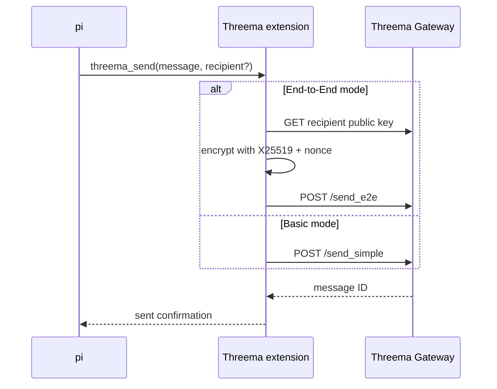
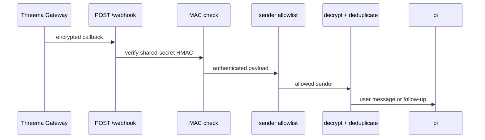

# Threema extension for pi

Send and receive Threema text messages from pi. End-to-End mode encrypts
outbound messages locally and accepts authenticated inbound webhooks; Basic
mode sends outbound plaintext to Threema Gateway and cannot receive messages.

## Message flow





Only text messages are supported. Invalid MACs, wrong Gateway targets,
unlisted senders, and duplicate message IDs are rejected before delivery.
Duplicate IDs are persisted under pi's agent directory across restarts.

## Requirements

- pi and Node.js 22 or newer
- a Threema Gateway ID and API secret
- E2E mode: a 32-byte X25519 private key and a publicly reachable webhook
- Basic mode: no key material; outbound only

## Installation

Install the repository as a pi package:

```sh
pi install https://github.com/ulvestuen/pi-kit
```

Pin with `git:github.com/ulvestuen/pi-kit@<tag-or-commit>`. To try a checkout
without installation, run:

```sh
pi -e /absolute/path/to/pi-kit/threema/index.ts
```

## Configuration

Copy `threema.example.json` to the private default location and restrict it:

```sh
mkdir -p ~/.pi/agent/extensions/pi-threema
cp /absolute/path/to/threema/threema.example.json \
  ~/.pi/agent/extensions/pi-threema/threema.json
chmod 600 ~/.pi/agent/extensions/pi-threema/threema.json
```

End-to-End mode (default):

```json
{
  "mode": "e2e",
  "apiId": "*MYAPID",
  "apiSecret": "your_api_secret_here",
  "privateKey": "0000000000000000000000000000000000000000000000000000000000000000",
  "recipientId": "ABCD1234",
  "allowedSenders": ["ABCD1234"],
  "webhookPort": 7633
}
```

Basic mode:

```json
{
  "mode": "basic",
  "apiId": "*MYAPID",
  "apiSecret": "your_api_secret_here",
  "recipientId": "ABCD1234"
}
```

| Field | Required | Purpose |
| --- | --- | --- |
| `apiId` | yes | 8-character Gateway ID |
| `apiSecret` | yes | Gateway API calls and inbound MAC verification |
| `recipientId` | yes | Default outbound recipient and default inbound allowlist |
| `mode` | no | `e2e` (default) or `basic`; must match the Gateway registration |
| `privateKey` | E2E | 64 hex characters for local encryption and decryption |
| `allowedSenders` | no | E2E sender IDs; defaults to `recipientId` |
| `webhookPort` | no | E2E HTTP port; defaults to `7633` |

Recipient public keys are fetched from `/pubkeys/<recipientId>` and cached in
memory; do not put them in config.

Set `THREEMA_CONFIG_PATH` to use another JSON file. `PI_CODING_AGENT_DIR`
changes both the default config root and duplicate cache location. Legacy
environment configuration from `.env.example` is used only when no JSON file
exists; `THREEMA_MODE` selects its mode.

## Webhook setup

In E2E mode the extension serves:

- `GET /health` → `ok`
- `POST /webhook` → Gateway callback

Configure the Gateway callback as
`http://<publicly-reachable-host>:<webhookPort>/webhook`. Machines behind NAT
need a tunnel, reverse proxy, VPN, or port forwarding. The callback URL is set
in the Gateway console, not in the extension config.

## Usage

The agent calls `threema_send` with required `message` text and an optional
`recipient` ID. Use it for concise questions, completion notifications, and
short status updates. An inbound message is injected as a user message; when
pi is busy it is queued as a follow-up.

Inside pi, `/threema` shows mode, API ID, recipient, allowed senders, webhook
status, duplicate count, and Gateway credits. Use `/reload` after changing
configuration.

## Verification

From the repository root:

```sh
npm test
```

This runs crypto unit tests and a focused webhook test covering MAC validation,
the sender allowlist, decryption, and busy-agent follow-up delivery.

## Troubleshooting and safety

- **Extension disabled:** verify the config path and required mode-specific
  fields, protect the file with mode `600`, then `/reload`.
- **Webhook rejected:** verify the API secret, private key, target Gateway ID,
  and `allowedSenders`.
- **No webhook traffic:** check the public callback, firewall, NAT/proxy, and
  `webhookPort`; `GET /health` distinguishes reachability from decryption.
- Never log the API secret or private key. Basic mode sends plaintext to the
  Gateway by design; use E2E mode when local encryption or inbound messaging is
  required.
